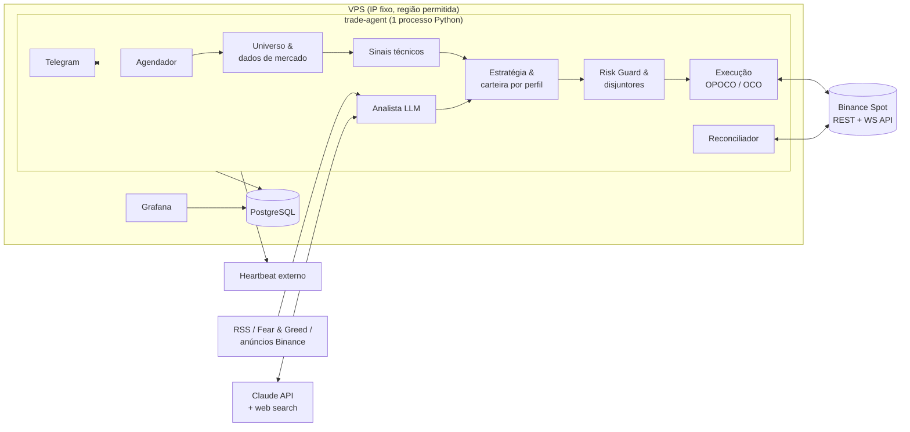
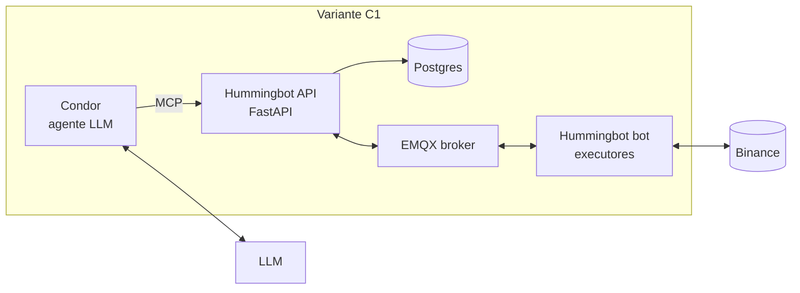

# 02 — Propostas de arquitetura

Este documento apresenta **três arquiteturas candidatas**, mostra como cada uma atende aos requisitos R1–R9 (ver [01-contexto-e-pesquisa.md](01-contexto-e-pesquisa.md)) e termina com uma **recomendação**.

Os dois insights iniciais aparecem nas propostas assim:

- **Opção 2** dos insights (Freqtrade + FreqAI, com LLM como camada de contexto) → **Proposta A**.
- **Opção 1** dos insights (LangGraph + MCP, multiagente) e a sugestão de avaliar o Hummingbot → **Proposta C**.
- A **Proposta B** é nova. Ela surgiu da pesquisa sobre as *order lists* nativas da Binance (OPOCO/OTOCO com trailing).

---

## Proposta A — “Freqtrade + Analista LLM” (framework primeiro)

### Visão

O **Freqtrade** é o núcleo de execução, análise técnica, risco, persistência e interface. Um serviço lateral pequeno (*sidecar*), o **Analista LLM**, roda de tempos em tempos, lê notícias e sentimento e publica dois arquivos JSON que o Freqtrade consome:

1. `pairlist.json`: lista de pares aprovados ou vetados, lida pela **RemotePairList** (`pairlist_url: file:///...`).
2. `market_context.json`: regime de mercado, score de sentimento por ativo e multiplicador de exposição. A estratégia lê esse arquivo nos *callbacks* (`populate_entry_trend`, `confirm_trade_entry`, `custom_stake_amount`).

```mermaid
flowchart LR
  subgraph VPS
    subgraph FT1["Freqtrade (perfil conservador)"]
      S1[Estratégia TA<br/>+ callbacks]
    end
    subgraph FT2["Freqtrade (perfil agressivo)"]
      S2[Estratégia TA<br/>+ callbacks]
    end
    AN["Analista LLM<br/>(cron, Python)"] -->|pairlist.json<br/>market_context.json| FT1 & FT2
    FT1 & FT2 --> DB[(SQLite/Postgres<br/>por instância)]
    UI[FreqUI / Telegram]
  end
  FT1 & FT2 <-->|REST/WS| BIN[(Binance Spot)]
  AN --> NEWS["RSS / Fear & Greed / Claude API"]
  FT1 & FT2 --> UI
```

### Como atende aos requisitos

| Req | Atendimento |
|-----|-------------|
| R1 | ✅ *Pairlists* dinâmicas (VolumePairList + filtros) ∩ RemotePairList alimentada pelo LLM; sinais de entrada e saída na estratégia |
| R2 | ⚠️ Uma **instância do Freqtrade por perfil**, cada uma com seu `config.json` (`available_capital`, `max_open_trades`, `stake_amount`, `stoploss`, `minimal_roi`, *protections*) |
| R3 | ✅ TA nativa (TA-Lib e `technical`); notícias e sentimento pelo sidecar |
| R4 | ⚠️ **Parcial.** `stoploss_on_exchange` coloca um *stop-loss-limit* na Binance que continua valendo com o bot desligado. Porém o **trailing congela** (o bot é quem move o stop) e **não há take-profit na exchange**, porque o saldo fica bloqueado pelo stop |
| R5 | ✅ *Protections* nativas (MaxDrawdown, StoplossGuard, CooldownPeriod, LowProfitPairs) + comandos `/stop`, `/stopentry` |
| R6 | ✅ FreqUI, Telegram, *webhooks*; Grafana opcional sobre o banco |
| R7 | ✅ Maduro: persistência de *trades*, reconciliação de ordens na partida |
| R8 | ✅ Poucas peças: Freqtrade + sidecar |

**Prós:** o caminho mais rápido até o *paper trading*; backtest, hyperopt e *dry-run* de primeira linha; comunidade grande.
**Contras:** R4 só parcial; cada perfil vira um processo separado; o LLM fica “de fora”, sem visão das posições além do que for exportado; a lógica precisa se encaixar no modelo de *callbacks* do framework.
**Escolha A se:** aceitar que, com o agente desligado, o stop fica fixo no último nível e não existe realização de lucro no servidor.

---

## Proposta B — “Núcleo enxuto com proteção nativa na Binance” ⭐ recomendada

### Visão

Um **único serviço Python** com responsabilidades bem separadas. As partes genéricas usam **bibliotecas maduras** (SDK oficial da Binance, TA-Lib, SQLAlchemy, APScheduler, SDK da Anthropic, python-telegram-bot). Toda posição nasce com uma ordem **OPOCO**: uma compra que, ao executar, arma sozinha no servidor da Binance um par OCO com **take-profit com trailing** e **stop-loss**. O LLM atua como **analista**, não como operador: gera scores e vetos estruturados que o código combina com a análise técnica.

### Como atende aos requisitos

| Req | Atendimento |
|-----|-------------|
| R1 | ✅ Universo dinâmico (liquidez, spread, idade, delistagem, *tiers*) → score técnico → *overlay* de sentimento → seleção de carteira. Saídas por deterioração de score (rotação) |
| R2 | ✅ Perfis em YAML no mesmo processo, cada um com cota de capital, *tiers* permitidos, risco por trade, parâmetros do OPOCO e peso do LLM. Razão virtual por perfil, ou subcontas quando a conta for VIP 1+ |
| R3 | ✅ TA determinística; LLM com busca web e fontes RSS produz `MarketView` estruturado (sentimento, confiança, catalisadores, riscos, veto) |
| R4 | ✅ **Completo.** OPOCO: entrada + OCO (acima `TAKE_PROFIT` com `trailingDelta` e ativação; abaixo `STOP_LOSS`) **no servidor da Binance**. Com o agente desligado, o stop protege e o trailing continua capturando alta |
| R5 | ✅ Disjuntores configuráveis (perda diária, *drawdown*, perdas seguidas, *crash* do BTC, Fear & Greed, orçamento do LLM, saúde da API) com ações graduais; *kill switch* via Telegram |
| R6 | ✅ Grafana (dashboards e regras de alerta) sobre o Postgres; Telegram para alertas e comandos; heartbeat externo |
| R7 | ✅ **Simplificado pela proteção nativa:** a exchange guarda o que é crítico; o agente persiste intenções e diário e reconcilia na partida. Uma queda **nunca** deixa posição sem stop (salvo a janela de ajuste de OCO, que é tratada) |
| R8 | ✅ 3 contêineres (agente, Postgres, Grafana). Sem broker de mensagens, sem Redis, sem Prometheus, sem LangGraph. Código próprio concentrado na regra de negócio (estimativa de ~3–5 mil linhas) |

**Prós:** atende 100% do R4; o comportamento com o agente desligado é previsível; controle total da lógica; custo de LLM baixo e limitado; o *paper trading* sai de graça pelo **Demo Mode** da Binance, sem simulador próprio.
**Contras:** mais código próprio que a Proposta A (execução, reconciliação, dashboards); o backtest do motor técnico precisa de um “laboratório” (proposta: usar o **Freqtrade apenas como ferramenta offline de backtest e hyperopt** dos sinais técnicos, sem reescrever backtester).
**Escolha B se:** o R4 for inegociável, como o enunciado sugere.

---

## Proposta C — “Agente LLM-cêntrico” (Condor/Hummingbot API ou LangGraph + MCP)

### Visão

O LLM é o **tomador de decisão central**. Ele observa, orienta, decide e age (ciclo OODA) usando ferramentas: dados de mercado, notícias e execução. Uma camada determinística aplica limites de risco. Há duas variantes:

- **C1 — Condor + Hummingbot API** (open source, 2026): o agente é definido em Markdown (`agent.md` com limites de segurança) e opera via servidor MCP do Hummingbot; a execução usa executores *triple barrier* do Hummingbot.
- **C2 — LangGraph + ferramentas Binance** (insight 1): grafo com nós *Data Fetcher* → *Sentiment* → *Decision (LLM)* → *Hard Risk Guard* → *Execution*; tools via Binance Skills Hub ou SDK.

### Como atende aos requisitos

| Req | Atendimento |
|-----|-------------|
| R1 | ✅ Máxima autonomia, porém menos previsível e reprodutível |
| R2 | ⚠️ Limites por agente no `agent.md`/*risk engine*; a granularidade depende do framework |
| R3 | ✅ Nativo, com o LLM raciocinando sobre tudo |
| R4 | ❌/⚠️ Os executores do Hummingbot **monitoram as barreiras em processo**, então **não protegem com o bot desligado**. Na variante C2 seria preciso implementar OPOCO de qualquer forma, o que cai na Proposta B |
| R5 | ✅ *Risk engine* com limites básicos (tamanho de posição, perda diária, *drawdown*, custo do LLM) |
| R6 | ✅ Telegram e dashboard |
| R7 | ⚠️ Mais peças para manter vivas (Condor, API, Postgres, EMQX, bot) |
| R8 | ❌ A variante com mais componentes e o custo de LLM mais alto, já que o modelo participa de cada ciclo |

**Prós:** a abordagem mais “agêntica”; interação em linguagem natural; boa para exploração.
**Contras:** decisões não determinísticas no caminho crítico; backtest praticamente impossível; custo de tokens proporcional à frequência; superfície de *prompt injection* maior; Condor ainda jovem (lançado em abril/2026); não atende o R4 como está.
**Escolha C se:** o objetivo principal for pesquisa ou experimentação com agentes, e não operar capital com previsibilidade.

---

## Matriz comparativa

| Critério | A — Freqtrade + LLM | **B — Núcleo nativo** | C — LLM-cêntrico |
|----------|---------------------|-----------------------|------------------|
| R1 Autonomia de pares | ✅ | ✅ | ✅ |
| R2 Perfis | ⚠️ 1 processo/perfil | ✅ | ⚠️ |
| R3 TA + notícias/sentimento | ✅ | ✅ | ✅ |
| **R4 Proteção com agente desligado** | ⚠️ só stop fixo | ✅ **stop + trailing TP nativos** | ❌ |
| R5 Condições de parada | ✅ | ✅ | ✅ |
| R6 Monitoramento | ✅ pronto | ✅ a montar (Grafana) | ✅ |
| R7 Resiliência | ✅ madura | ✅ (por desenho) | ⚠️ |
| R8 Simplicidade | ✅ | ✅ | ❌ |
| Código próprio | Baixo | Médio | Baixo a médio |
| Backtest da parte técnica | ✅ nativo | ✅ via Freqtrade offline | ❌ |
| Custo mensal de LLM | Baixo | Baixo (com teto) | Alto |
| Esforço estimado até o *paper trading* | ~4–6 semanas | ~9–12 semanas | ~4–8 semanas (incerteza alta) |

## Recomendação

**Adotar a Proposta B**, pelos motivos abaixo:

1. **R4 é o requisito diferenciador** e só a B o atende por completo. Com OPOCO + `trailingDelta`, a Binance protege a posição e realiza lucro **mesmo com o agente desligado, travado ou sem rede**.
2. **R4 simplifica o R7.** Se o que é crítico mora na exchange, a recuperação vira *reconciliar e seguir*, e não *reconstruir estado frágil*. A queda do agente passa a ser um evento de baixa severidade.
3. **O papel do LLM fica no lugar certo:** analista com saída estruturada e autoridade assimétrica (pode vetar ou reduzir, nunca ampliar risco). Isso preserva previsibilidade, custo e segurança contra *prompt injection*.
4. **Simplicidade real:** 3 contêineres; nada de broker, cache ou orquestrador de agentes. O código próprio cobre apenas o que nenhum framework maduro oferece hoje.
5. **Sem reinventar a roda:** SDK oficial da Binance para a API, TA-Lib para indicadores, Freqtrade como **laboratório offline** de backtest e hyperopt, Demo Mode da Binance como *paper trading*, Grafana para painéis e alertas, Telegram para interação.

**O que reaproveitar das outras propostas:**

- Da **A**: os conceitos de *Protections* e filtros de *pairlist* do Freqtrade viram parâmetros de configuração da B. O Freqtrade continua como ferramenta de pesquisa.
- Da **C**: o padrão “camada probabilística separada da camada determinística” (Condor) e os papéis de analistas do TradingAgents como inspiração para os *prompts* do Analista LLM. O Binance Skills Hub pode ser usado no Claude Code **durante o desenvolvimento** para exploração manual.

**Plano B:** se, após a Fase 0 do plano (spike técnico), alguma premissa sobre OPOCO e trailing falhar no Demo Mode ou no Testnet, a Proposta A passa a ser a alternativa de menor risco. O analista LLM e os perfis continuam aproveitáveis.

O detalhamento da Proposta B está em [03-arquitetura-recomendada.md](03-arquitetura-recomendada.md) e o plano de construção em [04-plano-de-construcao.md](04-plano-de-construcao.md).
