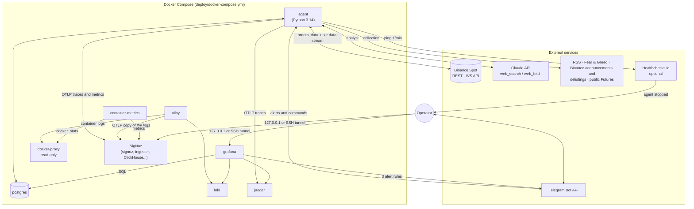
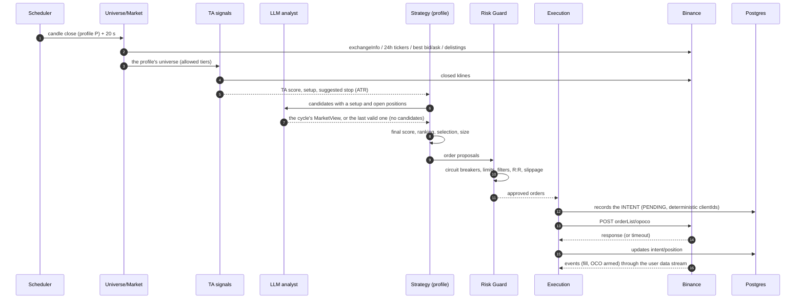
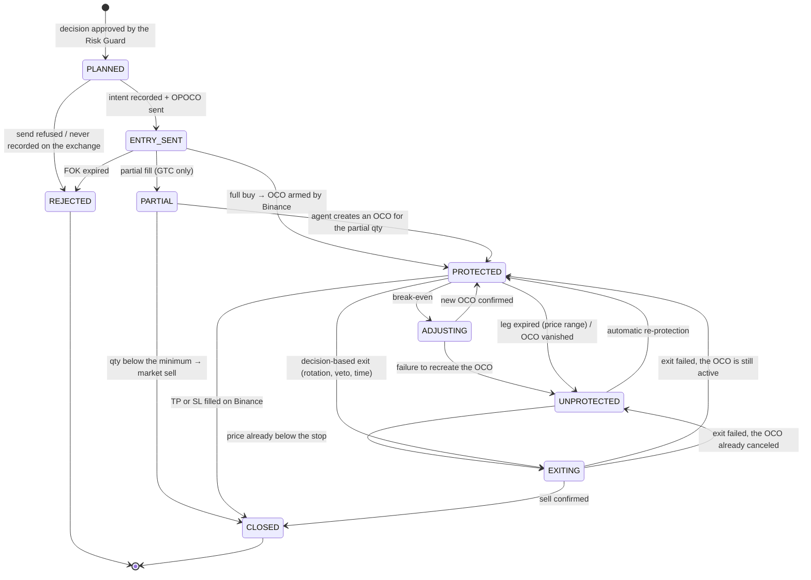
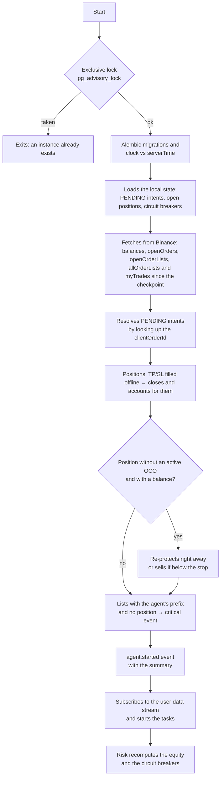

# 03 — Architecture: a lean core with native protection on Binance

> How the agent is built and why. The values in force live in the `config/` files, which are the source of truth; the numbers quoted here are examples. They are not investment advice.

**Why this architecture:** none of the mature frameworks evaluated (Freqtrade, Hummingbot, OctoBot) uses Binance's native *order lists* to keep the position protected with the bot turned off. Freqtrade only leaves a fixed stop on the exchange, without a take-profit, and Hummingbot's executors monitor the barriers inside the process. That is why the core is in-house and small: every position is born as an OPOCO, with the trailing take-profit and the stop on Binance's server (doc 01, §2). With what is critical kept on the exchange, recovering from a crash means reconciling and moving on. Freqtrade remains the offline backtesting lab for the same signals.

## 1. Design principles

1. **Binance keeps the protection.** Every position is born protected by a native *order list* (OPOCO). The agent can crash at any moment without leaving a position exposed.
2. **The LLM analyzes; the code decides and executes.** The LLM produces structured data (scores, vetoes, risks). It **can veto or reduce risk, never increase it**. The LLM has no access to the order API or to the keys.
3. **Deterministic critical path.** Risk Guard, position sizing and order building are pure, testable code.
4. **The exchange is the source of truth.** The local database keeps **intents** (what was attempted), the **journal** (what happened) and the **context** (why it was done). Reconciliation resolves mismatches.
5. **Idempotency everywhere.** Order IDs derive from the decision, recorded before sending. An uncertain outcome leads to a lookup by ID, never to a blind resend.
6. **Configuration as code.** Profiles, stop conditions and the analyst live in versioned YAML validated by schema. Telegram's `/config` shows the *hash* of the configuration in use.
7. **Fewer pieces on the critical path.** The core is a Python process and PostgreSQL. Observability (Grafana, Loki, Jaeger, SigNoz) runs in separate containers: with any of them down, the agent keeps trading.

## 2. Container view



## 3. Technology stack

| Concern | Component | Why |
|---------|-----------|-----|
| Language | **Python 3.14** (compatible with ≥ 3.12), `uv`, `ruff`, `mypy`, `pytest` | Quant ecosystem and official SDKs (D-002) |
| Core | **`asyncio`**, with periodic tasks, candle-close *jobs* and supervised services in `runtime.py` | WebSocket, Telegram, HTTP and scheduling in a single process, without a scheduling library (D-003) |
| Binance API | **Thin in-house client** over `httpx` (REST) and `websockets` (WebSocket API), with Ed25519/HMAC signing through `cryptography` | `Decimal` end to end (no `float`), errors mapped by semantics (rejected × unknown status), weight headers, an order-sending lock, 100% testable with `respx` (D-001) |
| Indicators | **TA-Lib** + pandas | Market standard and mature (D-015) |
| LLM | **`anthropic` SDK**: `claude-opus-5` for the reading and `claude-sonnet-5` for the triage (`config/research.yaml`) | *Structured outputs*, server-side web search and *prompt caching* (D-019) |
| News collection | `feedparser` + `httpx` | RSS and simple APIs |
| Configuration | **pydantic-settings** (`.env`, `TA_` prefix) + YAML validated by pydantic | Strong validation of profiles and limits |
| Persistence | **PostgreSQL 18** + SQLAlchemy 2 (asyncpg) + Alembic | Reliable, with concurrent access by Grafana and versioned migrations (D-008) |
| Logs | `structlog` in JSON, with the `trace_id` on every line | Structured logs linked to the traces |
| Traces and metrics | **OpenTelemetry** (OTLP/HTTP) to Jaeger and SigNoz | Each component is a service; agent metrics every minute (§12.1) |
| Alerts and commands | **Thin in-house client** for the Telegram Bot API, over `httpx` | Push on the phone and a remote *kill switch* (D-022) |
| Dashboards and metric alerts | **Grafana 12.2** (Postgres, Loki and Jaeger; Telegram *contact point*) | Business metrics are low frequency and already in the database |
| Centralized logs | **Loki**, collected by **Grafana Alloy** | Logs of every container for 30 days |
| Traces | **Jaeger** (7 days on disk) | Dependency graph between the components |
| Parallel observability | **SigNoz** (ClickHouse) | Traces, logs and metrics in one place, for comparison (§12.1) |
| External heartbeat | **Healthchecks.io**, optional (`TA_HEALTHCHECK_URL`) | Detects the agent or the machine being down, something internal monitoring cannot do |
| Backtesting lab (offline) | **Freqtrade** through Docker (backtesting and *hyperopt*) | Reuses a mature backtester. The "shell" strategy imports the `signals` package (D-014) |
| Deployment | **Docker Compose** | Simple and reproducible |

**Deliberately left out:** Redis, a message broker, Prometheus, Kubernetes, LangGraph/CrewAI, a vector database. Each would add operations without solving a problem the design has.

## 4. Code structure

```text
src/trade_agent/
  cli.py                  # trade-agent command: run, queries, manual orders, research
  app.py                  # builds the agent: API, database, risk, decision, analyst, Telegram
  runtime.py              # exclusive lock, migrations, recovery, tasks and services
  tracing.py, metrics.py  # OpenTelemetry: spans per component and agent metrics
  log.py                  # structlog in JSON, secrets masked
  config/                 # settings from the .env (pydantic-settings)
  exchange/               # in-house client (REST + WS API): signing, filters, rounding,
                          #   weight, clock, user data stream, environments (testnet/demo/prod)
  market/                 # candles and the universe with tiers
  signals/                # PURE FUNCTIONS: technical features, score and setups (also used in the lab)
  research/               # news and metrics collection, triage and the LLM analyst (MarketView)
  strategy/               # profiles (YAML), portfolio and sizing, exits and break-even
  decision/               # decision cycle per profile and the candle-close schedule
  risk/                   # stop conditions, states, equity monitor, pre-trade
  execution/              # IDs, OPOCO/OCO building, idempotent gateway, position service
  reconcile/              # assessment of each position against the exchange and reconciliation
  persistence/            # SQLAlchemy models, repositories, Alembic migrations
  notify/                 # Telegram: client, alerts, commands and /status
  telemetry/              # telemetry snapshots in Postgres and the heartbeat
lab/
  walk_forward.py         # per-window backtests in Freqtrade (Docker), with hyperopt in training
  freqtrade/              # docker-compose and the "shell" strategy that imports trade_agent.signals
scripts/                  # spike_opoco.py, grafana_dashboards.py, signoz_dashboards.py
evals/analyst/            # labeled cases to evaluate the analyst (D-021)
config/
  profiles.yaml           # profiles (§8)
  stop_conditions.yaml    # stop conditions and pre-trade (§10)
  research.yaml           # models, budget, sources and rules of the analyst (§7)
deploy/
  docker-compose.yml      # includes stack.yml with the root .env
  stack.yml               # services (§14)
  grafana/, loki/, alloy/, jaeger/, otelcol/, docker-proxy/, postgres/, signoz/
```

## 5. Jobs and cadence

| Job | Frequency | Role |
|-----|-----------|------|
| `user_data_stream` | continuous | Order and balance events over the WebSocket API (`userDataStream.subscribe.signature`); reconnects on `serverShutdown`. Each event triggers the sync of the affected position (D-011) |
| `check_risk` | 1 min | Agent equity (capital + realized + open PnL), BTC 1h, USDT peg, Fear & Greed, API errors → stop conditions → `pause`/`halt`/`flatten`. The same reading produces the metrics and, every 5 min, the telemetry snapshot |
| `heartbeat` | 1 min | External ping, only with `TA_HEALTHCHECK_URL` set |
| `reconcile` | 5 min + on every stream reconnection | Compares database × Binance and fixes it |
| `sync_time` | 10 min | Offset of the local clock to Binance's (three samples) |
| `ingest` | 15 min | RSS, Binance announcements, Fear & Greed, *funding*/OI |
| `universe_refresh` | on every `decision_cycle` (5 min cache, shared by the profiles of the same close) | Universe filters and *tiers* (D-027) |
| `research_cycle` | inside the `decision_cycle`, only with setups or positions | LLM analyst → `MarketView` (without candidates, the last valid reading holds) |
| `decision_cycle` | the profile's candle close + 20 s (e.g. 4h) | Signals → analyst → rule-based exits and *break-even* → entries (pre-trade checks) → OPOCO. With `TA_TRADING_ENABLED=false`, it runs in **simulation** (D-023) |
| `telegram` | continuous (*long polling*) | Operator commands (§12.3, D-022) |

The periodic tasks already run at startup, after the initial reconciliation. There is no automatic daily report or scheduled backup yet: the backup is manual (runbook, §4).

If the process restarts in the middle of a `decision_cycle`, the cycle can be redone safely: the already recorded intents and the deterministic IDs prevent duplicate orders, and an asset with an active position does not get a new entry (the "one asset at a time" rule and the pre-trade checks).

The profiles that close a candle together (today both, on 4h) run the cycle at the same time, but buy one at a time, with the positions read again at the time of the purchase (D-029).

On stop (SIGTERM), the agent finishes the task in progress and records `agent.stopped`. The wait for Telegram messages (*long polling*, up to 30 s) is interrupted right away, and compose gives the agent 30 s (`stop_grace_period`; in Kubernetes, `terminationGracePeriodSeconds`), enough for a news collection. A `decision_cycle` in progress takes minutes and is interrupted: at startup, the reconciliation restores the state (paragraph above).

## 6. Decision cycle



### 6.1 Universe

The universe is built every cycle, with the volume ranking of the moment (D-027):

1. `exchangeInfo`: `status = TRADING`, USDT quote asset and the `ocoAllowed`, `otoAllowed`, `opoAllowed` and `allowTrailingStop` flags.
2. Exclusions: stablecoins and fiat-pegged assets, leveraged tokens and pairs in `delist-schedule` (production only: Testnet and Demo do not have the route).
3. Liquidity: 24h volume of at least US$ 5 million and a spread of up to 20 bps.
4. History: at least 30 days of candles.
5. *Tiers* by USDT volume on Binance itself (D-013): `core` (BTC and ETH), `large` (ranks 1 to 20, excluding *core*), `mid` (21 to 60) and `small` (the rest). Each profile defines which *tiers* it may use and with what weight.

### 6.2 Technical signals (`signals/`, pure functions)

- **Features:** trend (EMA 50/200, ADX), momentum (RSI, MACD histogram, ROC), volatility (ATR%, Bollinger width), volume (relative volume, OBV slope), relative strength against BTC and BTC's regime (above or below its own EMA 200).
- **Score** ∈ [-1, 1], a sum of auditable components: trend (±0.35), momentum (±0.20), ADX strength (±0.15), relative strength (±0.20), volume (±0.10) and stretched RSI (−0.15).
- **Setups**, both **with the trend** (fast EMA > slow and price above the slow one) and only with the **market regime up** (D-016):
  - `trend_pullback`: ADX ≥ `adx_min`, previous RSI ≤ `rsi_pullback_max` and rising, on an up candle;
  - `breakout`: close above the high of the previous candles, with relative volume ≥ `vol_rel_min`.
- **Output:** `Signal(score, setup, stop_pct, atr_pct, close)`, read on the last closed candle. The suggested stop is `atr_mult × ATR%`, capped by the profile's `max_pct`.
- The same code runs **in the agent** and **in the Freqtrade lab**: the "shell" strategy imports `trade_agent.signals`. The parameters come from *hyperopt* in *walk-forward* (D-017), never from trial and error in production.

### 6.3 Blending, selection and sizing

- `final_score = (1 − w_llm) · TA_score + w_llm · (sentiment · confidence)`, with `w_llm` (`llm.weight`) set per profile. Without an LLM reading with the minimum confidence (`llm.min_confidence`), only the technical score counts.
- An LLM **veto** excludes the asset. If there is an open position in it, it triggers an exit.
- **Regime:** the LLM's `exposure_multiplier ∈ [0, 1]` scales the size of each position, not the number of slots (D-030). With 0, the profile opens no positions (reason `exposição zero`, zero exposure). Without a valid reading, each profile follows its `llm.on_failure` (§7.3).
- **Selection:** highest scores above `min_score`, honoring the slots (`max_open_positions`), the cash reserve, the *tier* limits and the one-position-per-asset rule across profiles.
- **Size:** `qty = (profile_capital × risk_per_trade) / (entry − stop)`, capped by `max_position_pct`, the budget and the *tier* limit, and then scaled by the `exposure_multiplier` (caution holds even when a limit defines the size), rounded to the `stepSize` and validated against `minNotional`.
- **Decision-based exits:** rotation (score ≤ `exit_score` for `exit_after_cycles` cycles), veto and maximum holding time (`max_holding`). After `break_even_after_r` R of profit, the agent raises the stop to the entry plus the fees.

## 7. LLM analyst (`research/`)

### 7.1 Flow

1. **Ingestion** (`ingest`, every 15 min): collects RSS, Binance announcements, Fear & Greed and *funding*/OI; removes duplicates by *hash*; tags the mentioned assets (symbol → names dictionary, in `config/research.yaml`); records them in `news_items`.
2. **Research**, inside the decision cycle and only when there are candidates with a setup or open positions (D-023). Without candidates, the last valid reading holds, up to `max_view_age_hours` (8 h). It can also be triggered by hand (`trade-agent research run`).
3. **Triage** (`claude-sonnet-5`), at the start of the research: the news not yet classified get relevance, category, severity and assets. Those with relevance below `min_relevance` leave the digest. If the triage fails, the research goes on with the untriaged news.
4. **Reading** (`claude-opus-5`), in **two steps** (D-019):
   - **(a) web verification**, optional (`web.enabled`): `web_search`/`web_fetch`, with up to 5 searches and 3 fetches, to confirm the risks and catalysts of the candidates and of the critical headlines. Returns findings as text, with the URLs;
   - **(b) structured reading**, without tools: the model receives the **digest** of the last 12 h, the market metrics, the candidates and the findings of step (a), and produces the `MarketView` with *structured outputs*.
5. **Output** validated by schema (pydantic) and recorded in `research_reports`, with model, *prompt* version, sources, tokens and cost.

### 7.2 Output contract (`MarketView`)

```json
{
  "as_of": "2026-09-25T12:00:00Z",
  "market_regime": "risk_on | neutral | risk_off",
  "global_sentiment": 0.35,
  "exposure_multiplier": 0.8,
  "global_risk_flags": ["FOMC today at 15:00 (volatility)"],
  "assets": [
    {
      "asset": "SOL",
      "sentiment": 0.6,
      "confidence": 0.7,
      "horizon": "days",
      "catalysts": ["network upgrade announced for 09/30"],
      "risk_flags": [],
      "veto": false,
      "rationale": "short, auditable summary",
      "sources": ["https://..."]
    }
  ]
}
```

### 7.3 Safety rules (enforced by code, not by the *prompt*)

- Capped numeric ranges: `sentiment ∈ [-1, 1]`, `confidence ∈ [0, 1]`, `exposure_multiplier ∈ [0, 1]`. Out-of-range values are truncated.
- **Asymmetric authority:** the LLM does **not** create entries outside the universe, does **not** change stops, TP or sizes beyond the profile's limits, and does **not** increase exposure.
- Positive sentiment above 0.5 requires **at least 2 cited sources**; without them, the value is lowered. Vetoes are accepted without a source, because they are conservative.
- External content goes into the *prompt* delimited and marked as **untrusted data**. The LLM has no write or execution tools.
- **Safe degradation:** without a valid reading (timeout, unexpected `stop_reason`, invalid JSON, budget exhausted or a reading older than 8 h), each profile follows its `llm.on_failure`: `ta_only` (pure TA), `ta_only_reduced` (pure TA, with each position at half size; the one used by both current profiles) or `pause_entries` (no new entries).

### 7.4 Use of the Claude API

- Reading with **`claude-opus-5`**, *adaptive thinking* and *effort* `high`; triage with **`claude-sonnet-5`**. The models, the token limits and the *timeout* live in `config/research.yaml`.
- **Structured outputs** (`output_config.format` with a JSON Schema generated by the SDK) in step (b). The schema requested from the model has no numeric constraints: the ranges are enforced by the code (§7.3), so an out-of-range value is truncated instead of invalidating the whole answer.
- Server tools `web_search_20260209` / `web_fetch_20260209` with `max_uses`.
- **Prompt caching** of the *system prompt*, the instructions and the schema, which make up the stable prefix.
- **Daily cost cap** of US$ 5 (`budget.daily_usd`, UTC day). Once it is reached, the analyst is not called and each profile degrades according to `llm.on_failure`. Tokens, cache, searches and cost per call are recorded in `llm_usage`, even when the response is invalid.
- **Cost observed on Demo** (2026-09-29 to 2026-10-03): from US$ 0.52 to US$ 4.25 per day, depending on the number of cycles with candidates, always below the cap. Step (a), the web verification, accounts for about 83% of the cost; the structured reading and the triage cost little (the evaluation, with step (b) only, came to US$ 0.02 per case). Prices in [05-references.md](05-references.md).

### 7.5 LLM evaluation

- **Labeled cases** (`evals/analyst/cases.yaml`, D-021): 31 situations, 19 historical and 12 synthetic (including *prompt* injection), with step (b) only. The last run (`trade-agent research eval`, 2026-09-28) passed all 31 cases, with 100% of the outputs valid against the schema.
- **Not implemented yet:** the A/B on Demo (a clone of each profile with `llm.weight = 0`) and the correlation between `sentiment` and the return of the following days. Without them, there is no measure of how much the LLM improves the result (doc 04).

## 8. Allocation profiles (R2)

The profiles live in `config/profiles.yaml`, validated by schema (`strategy/profiles.py`). The lab reads the same file (D-014). Profiles in use, calibrated on 2026-10-01 by the optimized *walk-forward* (D-028, [lab-results.md](lab-results.md)):

| | `swing_trend` (`swg`) | `momentum_alpha` (`mom`) |
|---|---|---|
| Capital | 65% of `managed_capital` (650 USDT) | 35% (350 USDT) |
| Timeframe | 4h | 4h |
| *Tiers* | core 70%, large 30% | core 30%, large 50%, mid 20% |
| Positions, size, reserve | up to 2; up to 42% of the capital; 15% reserve | up to 2; up to 42%; 15% reserve |
| Risk per trade | 1.2% | 1.5% |
| Entry | `min_score` 0.67, `limit_fok`, *slippage* up to 18 bps | `min_score` 0.67, `limit_fok`, up to 20 bps |
| Stop | fixed, 3.1 × ATR, at most 4.5% | fixed, 3.0 × ATR, at most 5% |
| Take-profit | trailing, activation at +9.7%, 100 bps pullback | trailing, activation at +9.5%, 130 bps pullback |
| *Break-even* and holding | after 1.2 R; 18 days | after 1.0 R; 6 days |
| Exit by score | `exit_score` −0.46, already on the first cycle | −0.46, on the first cycle |
| Signals | ADX ≥ 24, pullback RSI ≤ 41, relative volume ≥ 2.3 | ADX ≥ 29, RSI ≤ 35, volume ≥ 2.6 |
| LLM | weight 0.25, minimum confidence 0.65, `ta_only_reduced` | weight 0.30, confidence 0.60, `ta_only_reduced` |

The lab does not optimize the risk, the *break-even* or the maximum holding (D-017); those values are the user's.

Structure of a profile (the `swing_trend` values):

```yaml
account:
  quote_asset: USDT
  managed_capital: 1000         # the agent's capital cap (the rest of the account is ignored)
  one_position_per_asset: true  # two profiles never on the same asset

profiles:
  swing_trend:
    code: swg                   # goes into the order IDs (ta1-swg-...)
    enabled: true
    capital_share: 0.65         # fraction of managed_capital
    timeframe: 4h               # 15m | 1h | 4h | 1d
    tiers: {core: 0.70, large: 0.30, mid: 0.0, small: 0.0}   # maximum allocation per tier
    allocation:
      max_open_positions: 2
      max_position_pct: 0.42
      cash_reserve_pct: 0.15
      risk_per_trade_pct: 1.2   # % of the profile's capital lost if the stop fills
    entry:
      min_score: 0.67
      order: limit_fok          # limit_fok | limit_maker_gtc
      max_slippage_bps: 18
    protection:                 # becomes the OPOCO's OCO
      stop: {mode: fixed, atr_mult: 3.1, max_pct: 4.5}   # fixed | trailing
      take_profit: {mode: trailing, activation_pct: 9.7, trailing_delta_bps: 100}
      break_even_after_r: 1.2   # adjustment made by the agent
      max_holding: 18d
    exits: {exit_score: -0.46, exit_after_cycles: 1}
    signals: {adx_min: 24.0, rsi_pullback_max: 41.0, vol_rel_min: 2.3}
    llm: {weight: 0.25, min_confidence: 0.65, on_failure: ta_only_reduced}
```

**Several profiles in the same account:** each profile trades its share of `managed_capital`. The positions are tagged by the profile code in the prefix of the order IDs (`ta1-swg-...`, `ta1-mom-...`), and reconciliation is done **per position and per order**, not on the aggregate balance. Balances without the agent's tag are **ignored**. Even so, a dedicated account is recommended.

## 9. Execution and the position lifecycle (R4)

### 9.1 Default order model: OPOCO

Example request with the `swing_trend` protection (illustrative prices):

```text
POST /api/v3/orderList/opoco
symbol=SOLUSDT
listClientOrderId=ta1-swg-7f3a9c2b1d-0-L   # deterministic: app, profile, decision, seq and leg (§11.2)
workingType=LIMIT
workingSide=BUY
workingPrice=142.35                        # "marketable limit": best ask + slippage tolerance
workingQuantity=0.70
workingTimeInForce=FOK                     # all or nothing: no unprotected partial fill
workingClientOrderId=ta1-swg-7f3a9c2b1d-0-E
pendingSide=SELL                           # quantity = received on the buy (OPO)
pendingAboveType=TAKE_PROFIT
pendingAboveStopPrice=156.16               # activates the trailing at +9.7%
pendingAboveTrailingDelta=100              # sells after a 1% pullback from the top
pendingAboveClientOrderId=ta1-swg-7f3a9c2b1d-0-TP
pendingBelowType=STOP_LOSS                 # at market: a guaranteed exit on a drop
pendingBelowStopPrice=135.95               # 3.1 × ATR, at most 4.5% below
pendingBelowClientOrderId=ta1-swg-7f3a9c2b1d-0-SL
newOrderRespType=FULL
```

Options per profile:

| Parameter | Options | Note |
|-----------|---------|------|
| Entry | `limit_fok` (default) · `limit_maker_gtc` | FOK needs no partial-fill handling. GTC maker pays a lower fee, but needs a *timeout* and partial-fill handling (see 9.3) |
| Upper leg (`take_profit.mode`) | `trailing`: `TAKE_PROFIT` + `stopPrice` + `trailingDelta` · `limit`: `LIMIT_MAKER` (fixed target) | The trailing TP maximizes the gain with the agent turned off. Both profiles use `trailing` |
| Lower leg (`stop.mode`) | `fixed`: `STOP_LOSS` with `stopPrice` · `trailing`: `STOP_LOSS` with `trailingDelta` only (moves up with the price from the entry) | Always `STOP_LOSS` at market: it prioritizes getting out over the price. Both profiles use `fixed` |

> All these combinations passed on the Spot Testnet on 2026-09-28, and OPOCO has been running in Demo Mode since 2026-09-29 (doc 01, §3).

### 9.2 Position state machine



`UNPROTECTED` is always a **critical** alert and the reconciler acts immediately.

### 9.3 Special cases

- **Partial fill (`limit_maker_gtc` entry):** the OPOCO only arms the OCO after the **full** fill. While the entry is partial, the position stays in `PARTIAL`, with a high event. If the entry ends with part of it filled (canceled or expired), the position goes to `UNPROTECTED`, and the agent creates a standalone OCO (`orderList/oco`) for the filled quantity, or closes it as dust if it is below the minimum. There is no automatic *timeout* to cancel a GTC entry, and with the agent turned off the filled part stays unprotected: that is why the profiles use **FOK**.
- **Protection adjustment** (*break-even*): there is no atomic *order list* swap. The agent records the `adjust` intent, cancels the list and creates the new OCO right after; the unprotected window is milliseconds long. If the new OCO is **rejected**, it **sells at market** (*fail-safe*, D-007). On a connection failure, it records a critical event and tries again on the next sync. With an uncertain outcome, the reconciliation looks up the ID before any resend.
- **Decision-based exit:** cancel the list and sell at market.
- **Stop expired by *price range*:** the *user data stream* event carries the `expiryReason`. The position goes to `UNPROTECTED`, and the agent re-protects it over the average entry price or sells at market, if the price has already crossed the stop (D-010).
- **Order send *timeout*:** **never** resend blindly. Binance accepts repeating a `listClientOrderId` when the previous list has already finished, which would cause a **duplicate**. First look it up by the client ID; only resend if it does not exist (D-006, D-012).

### 9.4 What happens with the agent turned off

| Situation | Result |
|-----------|--------|
| Open position and the price falls to the stop | `STOP_LOSS` fills on Binance; the TP is canceled automatically |
| The price rises past the activation | The trailing TP follows the top and sells on the configured pullback |
| Stop in trailing mode | The stop moves up with the price, offline too |
| Extreme drop outside the execution range | The stop may expire and the position stays unprotected until the agent comes back. Grafana's "Agente sem telemetria" alert (and the external heartbeat, if configured) warns that the agent is down |
| Very negative news | No LLM reaction (offline). The price-based protection stays active |
| Agent down for days | The positions close by stop or TP. No new entries. The capital goes back to the stablecoin |

## 10. Risk Guard and stop conditions (R5)

### 10.1 Pre-trade checks (always, no exceptions)

Done in `pre_trade_violations`, for each entry idea: an operating state that allows entries · trading window (`trading_window_utc`) · no active position in the asset · asset without an analyst veto and not being delisted · minimum R:R (take-profit activation ÷ stop) after the round-trip fee · risk to the stop ≤ `risk_per_trade_pct`, with the rounding tolerance · `trailingDelta` within the `TRAILING_DELTA` filter. Before that, the portfolio has already applied the slots, the cash reserve and the *tier* limits (§6.3), and the order building rounds price and quantity to the filters (`PRICE_FILTER`, `LOT_SIZE`, `NOTIONAL`), with the limit price at most `max_slippage_bps` from the best bid/ask. Every entry goes out protected: `ProtectionPolicy` refuses, when built, a policy without a stop.

### 10.2 Operating states (global and per profile)

| State | New entries | Protections on Binance | Rule-based exits | Return |
|-------|-------------|------------------------|------------------|--------|
| `RUNNING` | ✅ | ✅ | ✅ | — |
| `PAUSED` | ❌ | ✅ | ✅ | Automatic after the `cooldown`, or manual |
| `FLATTENING` | ❌ | Cancels and sells | — | Goes to `HALTED` |
| `HALTED` | ❌ | ✅ (kept) | ❌ | **Manual only** (`/resume`) |

The state is **persisted** and still holds after a restart. An agent restarted in `PAUSED` stays paused.

### 10.3 Configurable triggers

Values in force in `config/stop_conditions.yaml`:

```yaml
global:
  max_daily_loss_pct:      {value: 3,   action: pause,      cooldown: 24h}
  max_drawdown_pct:        {value: 15,  action: halt}                      # from the peak
  max_consecutive_losses:  {value: 4,   action: pause,      cooldown: 12h}
  btc_move_1h_pct:         {value: -6,  action: pause,      cooldown: 4h}
  quote_depeg_pct:         {value: 1.5, action: flatten}                   # USDT off its peg
  fear_greed_below:        {value: 10,  action: pause,      cooldown: 24h}
  api_error_rate_5m:       {value: 0.2, action: pause,      cooldown: 30m}
  reconcile_mismatch:      {action: pause}                                 # until diagnosed (orphans; errors only in 2 reconciliations in a row)
  profit_target_pct:       null                                            # e.g. {value: 30, action: halt}
  trading_window_utc:      null                                            # e.g. ["00:00-23:59"]
```

Under `per_profile`, a profile can have its own `max_daily_loss_pct` and `max_consecutive_losses`, which pause only that profile. Under `pre_trade` live the limits of the pre-trade checks: a minimum R:R of 1.5 after the 0.2% round-trip fee, and a 5% tolerance over the risk per trade.

The cap on LLM spending lives in `config/research.yaml` (`budget.daily_usd`, D-019): once it is reached, the analyst is not called and each profile degrades according to `llm.on_failure`. Semantics (D-024): the losses and the target are measured on the **agent's equity** (managed capital + realized PnL + open PnL), not on the account balance; automatic triggers only **escalate** the state; a `flatten` ends in a marked `HALTED`, and the same trigger does not repeat it until the `/resume`. Each trigger acts **once per occurrence** (D-026): while the condition still holds, it neither extends the pause nor alerts again, and `/resume` and the end of the `cooldown` hold. It acts again when the condition clears and comes back, or when it gets one full limit worse (4 → 8 consecutive losses; daily loss of 3% → 6%).

**Kill switch:** `/halt` (keeps the protections) and `/flatten` (closes the positions, with a confirmation code) on Telegram. With `TA_TRADING_ENABLED=false` (the default), the client blocks every order submission from startup, and the agent runs in simulation (D-023).

## 11. Persistence, idempotency and recovery (R7)

### 11.1 Data model (main tables)

| Table | Contents |
|-------|----------|
| `intents` | The intent before anything is sent: type (`open`, `protect`, `adjust`, `close`, `failsafe`), *payload*, client IDs and status (`pending` → `confirmed`, `failed` or `unknown`, the latter resolved by the reconciliation) |
| `positions` | Profile, symbol, state (the §9.2 machine), entry, protected quantity, protection parameters, PnL, fees and exit reason |
| `exchange_orders`, `fills` | Mirror of the Binance orders and fills (raw JSON included) |
| `events` | Audit trail with severity: decision cycles, risk state changes, Telegram commands, task failures, position events |
| `checkpoints` | Key-value state: risk states per scope (`risk.state.*`), triggers already fired (`risk.fired`), the day open and the equity peak (`risk.equity`), the Telegram *offset* |
| `telemetry_snapshots` | Snapshot of equity, PnL, exposure and API health every 5 min |
| `news_items`, `research_reports`, `llm_usage` | Collected and triaged news, the analyst's readings, tokens and cost of each call |

The decisions of each cycle are in the `decision.cycle` events (evaluated, entries, exits and rejections) and, in detail, in the logs and traces (§12.1).

### 11.2 Idempotency

- Deterministic `clientOrderId` and `listClientOrderId`, with up to 36 characters: `ta1-{profile}-{decision}-{seq}-{leg}` (e.g. `ta1-mom-7f3a9c2b1d-0-TP`). `seq` numbers the successive protections of the same position (0 = original OPOCO; 1.. = OCOs recreated in adjustments) and `leg` ∈ {`L`, `E`, `TP`, `SL`, `X`}. Implementation: `trade_agent.execution.ids`.
- The **intent → send → confirmation** pattern. With an uncertain outcome, the next step is always to **look up** the order by its client ID before any resend.
- Each entry decision has a unique ID (10 hex), recorded with the position before sending. The order and fill mirrors have unique keys (symbol + order or trade ID), so repeated *user data stream* events duplicate nothing.

### 11.3 Recovery at startup



- Orders **without** the agent's prefix are never touched. Lists **with** the prefix and without a matching position produce a critical event, with no automatic action (D-009), and count for the `reconcile_mismatch` circuit breaker, which pauses entries until diagnosed.
- The periodic reconciliation (every 5 min and on every stream reconnection) runs steps E–J. Orphans trip `reconcile_mismatch` right away. Errors (a check that did not finish: network, DNS, Binance down) only trip it when two reconciliations in a row fail (D-031).
- **Process resilience:** `restart: unless-stopped` in Docker; clock synced with Binance every 10 min; WebSocket reconnection with exponential *backoff*, with the periodic reconciliation covering lost events; the 418 and 429 errors carry the `Retry-After` reported by Binance and count in the failure rate that pauses entries (`api_error_rate_5m`).

## 12. Monitoring (R6)

### 12.1 Dashboards, logs, traces and metrics

Six Grafana dashboards, generated by `scripts/grafana_dashboards.py` (the dashboards themselves are in Portuguese):

1. **Visão geral** (overview): equity and peak, the day's PnL, drawdown, active positions, operating state, risk state changes and the last run of each task.
2. **Posições** (positions): active positions with their protection, unrealized PnL, exposure and positions closed in the period.
3. **Performance:** cumulative realized PnL, trades, hit rate, *profit factor*, fees paid, result per profile and asset and exit reasons.
4. **Decisões e pesquisa** (decisions and research): decision cycles, the analyst's latest reading, regime and exposure, the daily LLM cost, analyst cycles by status and news per source.
5. **Saúde técnica** (technical health): age of the last telemetry snapshot, pending intents, unprotected positions, critical events, API errors and weight, clock *offset* and high and critical events.
6. **Logs:** errors, warnings and tracebacks, volume per level and per service, the agent's most frequent events and text search.

The logs of every container are centralized in **Loki** for 30 days. They are collected by **Grafana Alloy**, which reads the Docker API through a read-only proxy on an exclusive internal network. The labels are `service` and `level`, and structlog's `event` goes as structured metadata.

The **traces** use OpenTelemetry with OTLP/HTTP export to **Jaeger** (7 days on disk). Each agent component is a service in the `trade-agent` namespace: runtime, risk, decision, research, LLM, execution, exchange, reconciliation, database, Telegram and telemetry. That way, Jaeger's *System Architecture* graph shows the dependencies between them. Jaeger publishes no ports on the host: the traces show up in Grafana (*Explore* → *Traces*), and the Jaeger UI only opens in development, through the `jaeger-ui` relay (`DEV_JAEGER_UI=1`, off by default). Each background task is the root of a trace. The spans never carry secrets or content: only paths, methods, counts, identifiers, tokens and costs. The `trace_id` goes in every log, and Grafana links logs and traces both ways.

**SigNoz** runs alongside, for comparison. It receives the same traces, an OTLP copy of the logs and the OpenTelemetry **metrics**. The agent's metrics go out every minute: equity, drawdown, PnL, exposure, positions, Binance errors and weight, clock, risk state, LLM cost and tokens, cycles, entries and exits. Each container's (CPU, memory, network and disk) come from an OpenTelemetry Collector with `docker_stats`. Latency, throughput and errors per operation are computed by SigNoz from the spans. Four dashboards (operation, technical health, LLM and containers) are generated by `scripts/signoz_dashboards.py` (runbook, §1.3).

### 12.2 Alerts

| Source | What it alerts on | Channel |
|--------|-------------------|---------|
| **Agent** | 🚨 each risk state change to `paused`, `halted` or `flattening`, once per occurrence of the trigger (D-026); ℹ️ the return to `running`; ℹ️ the entries and exits of each decision cycle | Telegram |
| **Grafana**, independent of the agent | **Agente sem telemetria** (no snapshot for more than 15 min, or a query without data); **Posição sem proteção** (`unprotected` for more than 1 min); **Drawdown elevado** (above 10% for 5 min) | Telegram |
| **Healthchecks.io**, optional | Agent or machine without a heartbeat | E-mail or the channel configured in Healthchecks |

The other high and critical events (failure to re-protect, orphan, unknown order outcome, failed task) are recorded in `events` and show up in the *Saúde técnica* dashboard → "Eventos altos e críticos", without a Telegram message. Without Telegram configured, the agent's alerts only go to the log.

### 12.3 Telegram commands

`/status` · `/positions` · `/pnl [dia|semana|mes]` · `/pause [scope]` · `/resume [scope]` · `/halt [scope]` · `/flatten [scope]` (requires a confirmation code) · `/report` (latest `MarketView`) · `/config` (active profiles and the configuration *hash*). The scope is `global` (default) or a profile name.
Only one authorized `chat_id`. Every command is audited in `events`.

## 13. Security

- **Binance key:** Ed25519; only *Reading* + *Spot Trading*; **withdrawals disabled**; restricted IP list; different keys for testnet, demo and production. On the account: 2FA, anti-phishing code and a withdrawal address whitelist.
- **Secrets:** out of the repository, in the `.env` and in `secrets/` (Ed25519 private key), both ignored by git. Sensitive settings are `SecretStr`, and the logs mask keys, signatures, passwords and tokens (`***`).
- **Isolated LLM:** it receives no secrets or detailed balances beyond what is needed and has no execution tools. The output goes through the schema and the limits.
- **Network:** every published port listens only on `127.0.0.1` (a test guarantees it). On a VPS, access is through an SSH tunnel or Tailscale, with key-only SSH, a firewall and automatic security updates.
- **Docker API:** only the collectors (Alloy and `container-metrics`) reach it, through a read-only proxy on an internal network, because inspecting a container shows its environment variables. No service other than the proxy mounts `docker.sock`.
- **Grafana:** reads the database with a read-only user (`grafana_ro`).
- **Backups:** still manual (`pg_dump`, runbook §4). An encrypted daily off-machine backup, with a restore test, is part of the *go-live* (doc 04).
- **Audit trail:** decision cycles, Telegram commands and state changes are recorded in `events`.

## 14. Deployment

`docker compose -f deploy/docker-compose.yml up -d` starts everything. The file includes `deploy/stack.yml` with the variables of the root `.env`, which is mandatory (runbook, §4).

| Service | Image | Role | Port (only `127.0.0.1`) |
|---------|-------|------|-------------------------|
| `agent` | built from the repository | the agent (`trade-agent run`); reads the `.env` and mounts `config/` read-only | — |
| `postgres` | `postgres:18` | the agent's database; creates the `grafana_ro` user on the first initialization | 5432 |
| `grafana` | `grafana/grafana:12.2.0` | dashboards, datasources and alerts provisioned as code | 3000 |
| `loki` | `grafana/loki:3.7.8` | logs for 30 days | — |
| `alloy` | `grafana/alloy:v1.20.1` | collects the container logs for Loki and SigNoz | 12345 |
| `docker-proxy` | `tecnativa/docker-socket-proxy:v0.5.0` | read-only Docker API, for Alloy and `container-metrics` | — |
| `jaeger` | `jaegertracing/jaeger:2.20.0` | traces for 7 days (pinned: 2.21 removed the API Grafana uses) | — |
| `jaeger-ui` | `alpine/socat:1.8.1.3` | development only (Windows): relays the Jaeger UI; off by default, `DEV_JAEGER_UI=1` turns it on | 16686 |
| `container-metrics` | `otel/opentelemetry-collector-contrib` | CPU, memory, network and disk of each container, for SigNoz | — |
| SigNoz (`signoz-*`, `ingester`) | Foundry manifests in `deploy/signoz/` | traces, logs and metrics in parallel | 8080, 14318 (OTLP) |

- **Environments:** `testnet` (order validation), `demo` (*paper trading*, where the agent runs today) and `prod`. It is the same image; only `TA_BINANCE_ENV` and the keys change.
- **Where it runs today:** on a Windows machine with Rancher Desktop, with the network quirks described in the runbook (§1.2). For production, the recommendation is a VPS with 2 vCPUs, at least 8 GB of RAM (SigNoz alone asks for 4 GB), a fixed IP and a **region allowed by Binance** (e.g. Tokyo, Frankfurt, São Paulo). Latency is not critical for swing trading.
- **Deploy:** `git pull` + `docker compose -f deploy/docker-compose.yml up -d --build`. The Alembic migrations run at startup, and the exclusive *lock* prevents two instances during the *deploy*.

## 15. Implementation decision log

| ID | Date | Decision | Reason | Discarded alternative |
|----|------|----------|--------|-----------------------|
| D-001 | 2026-09-26 | **Thin in-house client for the Binance API** (`httpx` + `websockets` + `cryptography`), instead of the official `binance-sdk-spot` SDK | The official SDK types price and quantity as `float` and serializes them with `str(float)`: `0.00001` becomes `1e-05`, which Binance rejects (`-1100`). The SDK also brings many dependencies (aiohttp, requests, websockets, websocket-client, pycryptodome) and generated code that is hard to simulate in tests. The surface needed is small: about 15 REST endpoints and the *user data stream* subscription | `binance-sdk-spot` (supports OPOCO, but with the problems above); CCXT (order lists only through the implicit API) |
| D-002 | 2026-09-26 | Python 3.14 in development and in the Docker image (project compatible with ≥ 3.12); `uv` with a lockfile | Every dependency has *wheels* for 3.14; `uv.lock` guarantees reproducible builds | pip + venv without a lockfile |
| D-003 | 2026-09-26 | **Asynchronous** core (`asyncio`) | The agent combines a WebSocket (*user data stream*), a scheduler, Telegram and concurrent HTTP in a single process | Threads |
| D-004 | 2026-09-26 | **100% test coverage (lines and branches)** required in CI for `src/`; `live` tests (Testnet/Demo) separated by a marker | Full coverage requirement. What depends on the real exchange is validated separately, without making the default suite depend on the network | Partial coverage |
| D-005 | 2026-09-26 | **In-memory simulated Binance** (`tests/support/fake_binance.py`) for the integration tests: HMAC signing, OPOCO/OCO, triggers with trailing, locked balances and fault injection | Test the critical flows (protection, idempotency, recovery) end to end, deterministically and without a network | Only per-endpoint mocks (they do not exercise the chaining of states) |
| D-006 | 2026-09-26 | Automatic retry **only** on a proven connection failure (request not sent). An unknown status (read timeout, 5xx, `-1006`/`-1007`) leads to a **lookup** by the client ID; if not found, `OrderOutcomeUnknownError` is left to the reconciliation | Binance accepts repeating a `listClientOrderId` after the previous list has finished, so resending blindly can duplicate positions | Resending with the same ID |
| D-007 | 2026-09-26 | Protection swap = cancel the list + create the new OCO; if the new OCO is **rejected**, **sell at market** (*fail-safe*); if the old list had already finished, nothing is sent | There is no atomic *order list* replacement in the API; the position can never be left unprotected | Keep the position unprotected until the next reconciliation |
| D-008 | 2026-09-26 | **asyncpg** driver for PostgreSQL | Asynchronous `psycopg` does not work with Windows' default *event loop* (Proactor). asyncpg works on Windows and Linux and is mature | psycopg 3 with a forced `SelectorEventLoop` |
| D-009 | 2026-09-26 | Agent lists without a matching position (**orphans**) produce a **critical alert, with no automatic action** | Without the context of the original decision (policy, profile), any automatic action would be a guess. The list itself already protects the balance on the exchange | Adopt the list by creating a synthetic position |
| D-010 | 2026-09-26 | **Re-protection** resolves the policy over the **real average entry price**. The TP activation and target move up to at least +10 bips over the current price, and the original stop is kept. If the price has already crossed the stop, the position is **sold at market** | Preserves the original risk plan without producing orders rejected for "immediate trigger" | Recompute the protection from the current price (it would change the risk) |
| D-011 | 2026-09-26 | The positions' state is **always derived from the exchange**: User Data Stream events only trigger the (REST) sync of the affected position; stream reconnections trigger the full reconciliation | A single derivation logic (`assess`), robust to lost, duplicated or out-of-order events | Apply the events incrementally to the local state |
| D-012 | 2026-09-26 | **60 s grace period** before concluding that an intent with no record on the exchange was never accepted; order IDs are **never reused** (`seq` always moves forward) | Binance's queries (the "Database" source) may lag a few moments behind the matching engine | Decide immediately based on a single lookup |
| D-013 | 2026-09-26 | **USDT** quote asset; timeframe **per profile** (today both profiles use 4h, D-028); **tiers by USDT volume** on Binance itself (BTC/ETH = *core*; the 24h volume ranking defines *large*/*mid*/*small*) | User's decision: higher liquidity and no external dependency (CoinGecko remains an optional improvement) | Market cap through CoinGecko |
| D-014 | 2026-09-26 | Backtesting lab = **official Freqtrade through Docker**. The "shell" strategy imports the same production `trade_agent.signals` and replicates the native protection (capped ATR stop, trailing TP with activation, risk-based size). `lab/walk_forward.py` generates the configuration from `config/profiles.yaml` (single source) | A mature backtester without mixing Freqtrade's pinned dependencies into the agent | Freqtrade in the same venv; an in-house backtester |
| D-015 | 2026-09-26 | Technical analysis in `float64` (TA-Lib/pandas); order prices and quantities always in `Decimal` | TA-Lib requires `float64`. The boundary is at order building (`round_price`/`round_qty`) | Decimal in the analysis (slow, not supported by TA-Lib) |
| D-016 | 2026-09-26 | Entry setups only **with the trend** (fast EMA > slow, also on the breakout) and with a **regime filter**: the benchmark (BTC) above its own slow EMA; can be turned off per profile (`signals.use_regime_filter`) | The first *walk-forward* showed *altcoin* buys with BTC falling and breakouts against the trend. These are classic filters, defined before the optimization | A regime filter only through the LLM (Phase 4) |
| D-017 | 2026-09-26 | Lab method: **walk-forward with optimization**. *Hyperopt* (`SharpeHyperOptLossDaily`, fixed seed; 150 epochs since 2026-10-01) on the **12 months before** each quarterly validation window; the chosen parameters are applied unchanged to the next window. The profile's **risk** parameters (maximum stop, risk per trade, maximum size) are **never optimized**. Comparison with the *buy & hold* of the basket and of BTC | Evaluates out of sample and avoids choosing parameters by looking at the test period | Backtest with fixed parameters (used only as a baseline); optimizing the whole period |
| D-018 | 2026-09-26 | **Superseded by D-028.** Phase 3 result: **conservador (4h) calibrated** with the medians of the *walk-forward* trainings (no *break-even*, exit by score on the 1st cycle, as in the lab) and **moderado (1h) disabled**. With a fixed stop, `protection.stop` (`atr_mult`, `max_pct`) is the **single source** of the ATR stop in the agent and in the lab | User's decision based on [lab-results.md](lab-results.md): positive out-of-sample expectancy only for conservador | Keep the illustrative parameters; iterate more in Phase 3 |
| D-019 | 2026-09-26 | Analyst in **two steps**: (a) optional web verification in free text with sources; (b) **structured reading without tools** (JSON Schema). Headline triage with `claude-sonnet-5`; reading with `claude-opus-5` (*effort* `high`); cap of **US$ 5/day** | User's decision (models and budget). The documentation does not guarantee *structured outputs* together with server tools; separating the steps also isolates the untrusted web content from the step that decides | A single call with search and schema |
| D-020 | 2026-09-26 | MVP sources (all public, keyless): Binance website announcements, RSS (CoinDesk, Cointelegraph, The Block, Decrypt), Fear & Greed (alternative.me) and *funding*/*open interest* from Binance Futures. Configured in `config/research.yaml` | User's decision; each source fails in isolation | CryptoPanic and other paid sources |
| D-021 | 2026-09-26 | Analyst evaluation with **31 labeled cases** (19 historical with paraphrased headlines and 12 synthetic with fictional assets, including prompt injection), running only step (b), **without web search** | Avoids the search's hindsight bias. The synthetic cases reduce the effect of the model already knowing the historical events | Evaluate with web search; historical cases only |
| D-022 | 2026-09-26 | Telegram through a **thin in-house client** (Bot API with `sendMessage` and `getUpdates` in *long polling*, through httpx). A single authorized `chat_id`; other chats are ignored and recorded; `/flatten` requires a confirmation code (2 min); the *offset* is persisted before running the command (at most one execution) | User's decision: a few lines, no framework, testable with respx (similar to D-001) | python-telegram-bot |
| D-023 | 2026-09-26 | Decision cycle **at the candle close** of each profile (+20 s), as in the lab. With the `TA_TRADING_ENABLED` lock off, the agent runs in **simulation**: it decides and records, without sending orders. The analyst is only called when there are setups or positions | User's decision; simulation makes it possible to watch the agent on Demo/production without risk | A fixed interval |
| D-024 | 2026-09-26 | Stop conditions with the values of doc 03 §10.3, measured on the **agent's equity** (managed capital + realized + open PnL, at the sell price); the day open and the peak are persisted. USDT peg from the median of USDC/USDT and FDUSD/USDT. States only escalate through triggers; `flatten` → a marked `HALTED` (it does not repeat) | User's decision (values). Balances that do not belong to the agent do not distort the losses | Equity of the whole account |
| D-025 | 2026-09-26 | Observability: `telemetry_snapshots` every 5 min (from the 1-min risk snapshot), an external heartbeat by URL (Healthchecks.io), **Grafana 12.2 provisioned as code**: 5 dashboards generated by `scripts/grafana_dashboards.py`, a *datasource* with a **read-only** user (`grafana_ro`) and 3 rules independent of the agent (no telemetry, unprotected position, drawdown) with a Telegram contact point. The `chatid` is rendered at container startup, because Grafana turns numeric environment variables into numbers. Later extended with the logs dashboard (6 in total), Loki and Alloy, traces in Jaeger and SigNoz in parallel (§12.1) | Checked on a real Grafana: provisioning, 34 queries through the API and evaluation of the rules | Prometheus + exporter; alerts only from the agent |
| D-026 | 2026-10-02 | Each stop trigger acts **once per occurrence**. The firing is recorded (`checkpoints`, `risk.fired`) while the condition holds; the trigger only acts again if it clears and comes back, or if it gets one full limit worse (4 → 8 consecutive losses; daily loss of 3% → 6%; drawdown of 15% → 30%). A trigger held back by a more restrictive state stays armed and acts after the `/resume` | User's decision (re-firing). Incident of 2026-10-02: with 4 consecutive losses, the condition kept holding, the 12h pause was extended and alerted every minute (890 alerts) and each `/resume` lasted until the next evaluation | Re-fire only when the condition clears; re-fire on every worsening (5th loss) |
| D-027 | 2026-10-03 | The universe is built **on every decision cycle**, with the volume ranking of the moment. The cache drops to 5 min, shorter than the shortest timeframe (15m), and only lets the profiles that close a candle together share one build, under a lock | With a 6 h cache and 4 h cycles, every other cycle used the previous cycle's universe. An asset breaking out on strong volume climbs the ranking precisely during those hours, and was left out: on 2026-10-03, ONE and AR (breakout, score 0.85) and RESOLV and SAND did not make it into the cycles. Cost: one build (`exchangeInfo` + 24h volume) per close | Keep the 6 h; a 1 h cache |
| D-028 | 2026-10-01 | Profiles `conservador` and `moderado` replaced by **`swing_trend` and `momentum_alpha`**, both on 4h. The optimized parameters (minimum score, signal filters, exit by score, take-profit and ATR stop) are the **median of the 15 trainings** of the optimized *walk-forward* (quarterly windows from 2023-01 to 2026-09, with candles since 2021-10). Risk, *break-even* and maximum holding are not optimized and keep the user's values | User's decision. Out of sample: `swing_trend` +107.27% compounded (7/15 positive windows, worst window drawdown of 11.20%) and `momentum_alpha` +34.36% (10/15, 13.68%), both below BTC *buy & hold* (+375%) ([lab-results.md](lab-results.md)) | Keep `conservador` and `moderado` |
| D-029 | 2026-10-07 | The profiles that close a candle together do the **buying step one at a time**, under an engine lock, with the active positions **read again at that moment**. The rest of the cycle (signals, research, exits) still runs in parallel | Each profile read the positions at the start of the cycle, and the research takes minutes before the purchase: on 2026-10-04, `swing_trend` and `momentum_alpha` bought STRKUSDT in the same minute (245 USDT in one asset, against `one_position_per_asset`), and the analyst classified the same news twice | Run the profiles in sequence (the second would wait for the first one's research) |
| D-030 | 2026-10-07 | The analyst's `exposure_multiplier` scales **only the size** of each position, applied after the size limits (risk, `max_position_pct`, budget and *tier*), and **not the number of slots**. With exposure 0, no entry (reason `exposição zero`, zero exposure) | Applied to the slots too (`floor(slots × exposure)`), caution counted twice: with 2 slots, any reading below 1.0 left 1, and on 2026-10-05 `momentum_alpha` refused 4 candidates for "sem vagas" (no slots) with 1 open position (exposure 0.85). Applied only to the risk budget, it did not hold when another limit defined the size (SPCXBUSDT, capped by the *tier*) | Round the slots to the nearest or up; keep rounding down |
| D-031 | 2026-10-07 | In `reconcile_mismatch`, **orphans count right away**, and **check errors** (network, DNS, Binance down) **only when two reconciliations in a row fail** | The circuit breaker pauses without a deadline, until the operator's diagnosis, and counted any error as a mismatch: on 2026-10-07, 2 min without DNS (06:00–06:02) made the 06:02 reconciliation fail, and entries stayed paused for 7 h (the 08:00 and 12:00 cycles), even though the 06:07 reconciliation came out clean. A long API outage already pauses through `api_error_rate_5m`, with a deadline | Ignore the check errors; require a minimum failure time instead of consecutive reconciliations |
