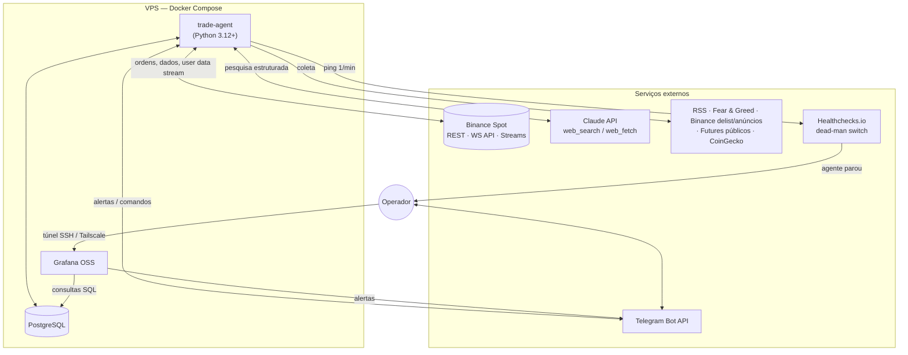
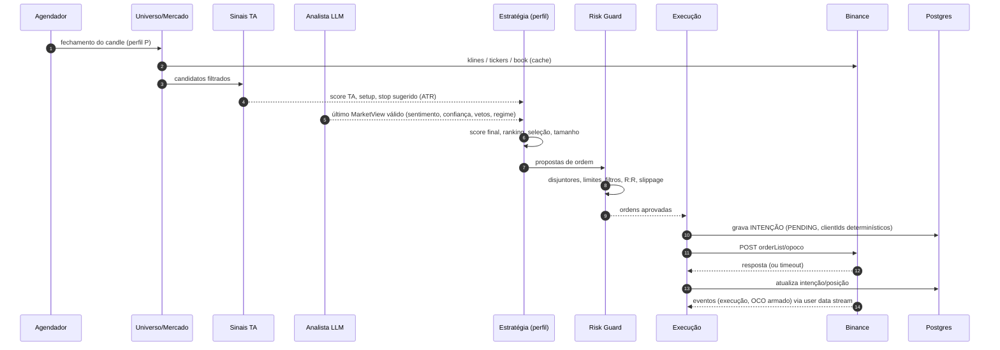
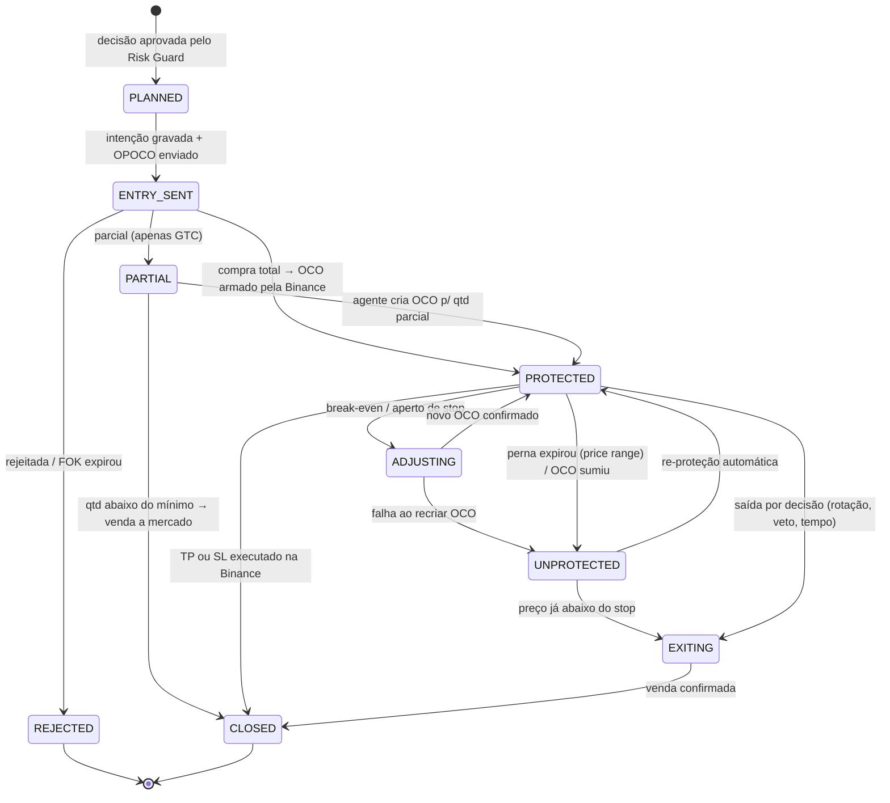
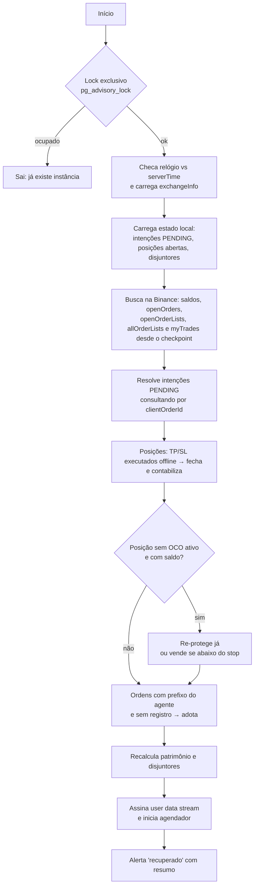

# 03 — Arquitetura recomendada (Proposta B): núcleo enxuto com proteção nativa na Binance

> Os valores numéricos deste documento (percentuais, pesos, limites) são **exemplos ilustrativos** para mostrar a parametrização. Não são recomendação de investimento. Calibre-os com backtest e *paper trading*.

## 1. Princípios de design

1. **A Binance guarda a proteção.** Toda posição nasce protegida por uma *order list* nativa (OPOCO). O agente pode cair a qualquer momento sem deixar posição exposta.
2. **O LLM analisa; o código decide e executa.** O LLM produz dados estruturados (scores, vetos, riscos). Ele **pode vetar ou reduzir risco, nunca ampliar**. O LLM não tem acesso à API de ordens nem às chaves.
3. **Caminho crítico determinístico.** Risk Guard, dimensionamento de posição e montagem de ordens são código puro e testável.
4. **A exchange é a fonte da verdade.** O banco local guarda **intenções** (o que se tentou fazer), o **diário** (o que aconteceu) e o **contexto** (por que foi feito). A reconciliação resolve divergências.
5. **Idempotência em tudo.** IDs de ordem determinísticos, ciclos com chave única e nenhum *retry* às cegas.
6. **Configuração como código.** Perfis e condições de parada ficam em YAML versionado e validado por schema. O *hash* da configuração é gravado com cada decisão.
7. **Menos peças.** Um processo Python, PostgreSQL e Grafana. Um componente só entra se eliminar código próprio relevante.

## 2. Visão de contêineres



## 3. Stack tecnológica

| Preocupação | Componente | Por quê |
|-------------|------------|---------|
| Linguagem | **Python 3.12+**, `uv`, `ruff`, `pytest`, `mypy`/`pyright` | Ecossistema quant e SDKs oficiais |
| API Binance | **Cliente próprio fino** sobre `httpx` (REST) e `websockets` (WebSocket API), com assinatura Ed25519/HMAC via `cryptography` | `Decimal` de ponta a ponta (sem `float`), erros mapeados por semântica (rejeitado × status desconhecido), cabeçalhos de peso, trava de envio de ordens, 100% testável com `respx`. Ver decisão D-001 (§15) |
| Indicadores | **TA-Lib** + pandas | Padrão de mercado, maduro, com *wheels* disponíveis |
| LLM | **SDK `anthropic`**, modelo **`claude-opus-5`** (configurável) | *Structured outputs*, busca web no servidor e *prompt caching* |
| Coleta de notícias | `feedparser` + `httpx` | RSS e APIs simples |
| Agendamento | **APScheduler** | Jobs em processo, sem infraestrutura extra |
| Configuração | **pydantic-settings** + YAML | Validação forte de perfis e limites |
| Persistência | **PostgreSQL** + SQLAlchemy 2 + Alembic | Confiável, com acesso concorrente pelo Grafana e migrações versionadas |
| Logs | `structlog` (JSON) | Logs estruturados e correlacionáveis por `cycle_id` |
| Alertas e comandos | **python-telegram-bot** | Push no celular e *kill switch* remoto |
| Dashboards e alertas de métricas | **Grafana OSS** (datasource Postgres, *contact point* Telegram) | Sem Prometheus: as métricas são de baixa frequência e já estão no banco |
| Heartbeat externo | **Healthchecks.io** (SaaS grátis ou *self-hosted*) | Detecta o agente ou a VPS fora do ar, algo que o monitoramento interno não consegue |
| Laboratório de backtest (offline) | **Freqtrade** (backtesting/hyperopt) | Reaproveita um backtester maduro. O pacote `signals` é importado por uma estratégia “casca” |
| Implantação | **Docker Compose** numa VPS | Simples e reprodutível |

**Deliberadamente fora:** Redis, broker de mensagens, Prometheus, Kubernetes, LangGraph/CrewAI, banco vetorial. Cada um adicionaria operação sem resolver um problema que o desenho tenha.

## 4. Estrutura do código

```text
src/trade_agent/
  main.py                 # bootstrap: lock exclusivo, recuperação, agendador
  config/                 # modelos pydantic + carga de YAML (perfis, paradas, fontes)
  exchange/               # cliente próprio (REST + WS API): assinatura, filtros, arredondamento,
                          #   rate limit, user data stream, ambientes (testnet/demo/prod)
  market/                 # klines, tickers, universo e tiers
  signals/                # FUNÇÕES PURAS: features técnicas e score (usadas também no lab)
  research/               # ingestão de notícias + analista LLM (schema MarketView)
  strategy/               # combinação de scores, ranking, seleção de carteira por perfil
  risk/                   # Risk Guard (validações pré-ordem) + disjuntores
  execution/              # montagem de OPOCO/OCO, gestor de posições, saídas
  reconcile/              # reconciliação na partida e periódica, re-proteção
  persistence/            # modelos SQLAlchemy, repositórios, migrações Alembic
  notify/                 # Telegram: alertas, relatórios, comandos
  telemetry/              # snapshots de métricas no Postgres, heartbeat
lab/
  freqtrade/              # estratégia "casca" que chama trade_agent.signals (backtest/hyperopt)
config/
  profiles.yaml
  stop_conditions.yaml
  sources.yaml
deploy/
  docker-compose.yml
  grafana/                # dashboards e alertas provisionados como código
```

## 5. Jobs e cadência

| Job | Frequência | Função |
|-----|-----------|--------|
| `user_data_stream` | contínuo | Eventos de ordem e saldo via WebSocket API (`userDataStream.subscribe.signature`); reconecta ao receber `serverShutdown` |
| `heartbeat` | 1 min | Ping externo e snapshot de saúde |
| `position_manager` | 1 min + eventos | Detecção de posição sem proteção, *timeouts*, *break-even*, saída por tempo |
| `reconcile` | 5 min + a cada reconexão | Compara banco × Binance e corrige |
| `equity_snapshot` | 5 min | Patrimônio, exposição e *drawdown* por perfil |
| `news_ingest` | 15 min | RSS, anúncios e delistagens Binance, Fear & Greed, *funding*/OI |
| `universe_refresh` | 4 h | Filtros de universo e *tiers* |
| `research_cycle` | 4 h + gatilhos | Analista LLM → `MarketView` |
| `decision_cycle` | no fechamento do candle do perfil (ex.: 1h/4h) | Sinais → estratégia → risco → execução |
| `daily_report` | diário | Resumo no Telegram |
| `backup` | diário | `pg_dump` criptografado para armazenamento externo |

Cada `decision_cycle` tem uma **chave única** (`perfil + horário de fechamento do candle`). Se o processo reiniciar no meio do ciclo, o ciclo é refeito com segurança, porque as intenções já gravadas e os IDs determinísticos impedem duplicidade.

## 6. Ciclo de decisão



### 6.1 Universo

1. `exchangeInfo`: `status = TRADING`, permissão SPOT, moeda de cotação do perfil, flags `ocoAllowed`/`otoAllowed`/`opoAllowed`/`allowTrailingStop`.
2. Exclusões: stablecoins e ativos atrelados a moeda fiduciária, tokens alavancados, ativos em `delist-schedule` ou com *monitoring tag*, listados há menos de N dias.
3. Liquidez: volume de 24h acima do mínimo, spread máximo (bps) e profundidade suficiente para o tamanho da ordem.
4. *Tiers* por capitalização (CoinGecko): `core` (BTC, ETH), `large`, `mid`, `small`. Cada perfil define quais *tiers* pode usar e com qual peso.

### 6.2 Sinais técnicos (`signals/`, funções puras)

- **Features:** tendência (EMA 50/200, ADX), momento (RSI, histograma MACD, ROC), volatilidade (ATR%, largura de Bollinger), volume (volume relativo, inclinação do OBV), força relativa contra o BTC, amplitude do mercado (percentual do universo acima da EMA).
- **Setups iniciais** (começar com 1–2): *pullback* em tendência e rompimento com volume. Reversão à média só em regime lateral, numa etapa posterior.
- **Saída:** `Signal(score ∈ [-1, 1], setup, stop_distance = k × ATR, invalidation)`.
- O mesmo código roda **no agente** e **no laboratório Freqtrade**: a estratégia “casca” chama `compute_features()` e `score()`. Ajustes de parâmetros saem do *hyperopt*, nunca de tentativa e erro em produção.

### 6.3 Combinação, seleção e dimensionamento

- `score_final = (1 − w_llm) · score_TA + w_llm · (sentimento · confiança)`, com `w_llm` definido por perfil.
- **Veto** do LLM ou *risk flag* grave (hack, delistagem, *depeg*, problema regulatório) exclui o ativo. Se houver posição aberta nele, dispara uma saída.
- **Regime:** o `exposure_multiplier ∈ [0, 1]` do LLM, combinado com o regime técnico do BTC, reduz o número máximo de posições e o tamanho delas.
- **Seleção:** maiores scores acima de `min_score`, respeitando os limites de *tier*, o máximo de posições, o limite de correlação e a regra de não duplicar o mesmo ativo entre perfis.
- **Tamanho:** `qtd = (capital_perfil × risco_por_trade) / (entrada − stop)`, limitado por `max_position_pct`, pela reserva de caixa e pelo `exposure_multiplier`, arredondado ao `stepSize` e validado contra `minNotional`.
- **Saídas por decisão:** rotação (score abaixo de `exit_score` por N ciclos), veto grave, tempo máximo de permanência.

## 7. Analista LLM (`research/`)

### 7.1 Fluxo

1. **Ingestão** (`news_ingest`, a cada 15 min): coleta RSS, anúncios e delistagens da Binance, Fear & Greed, *funding*/OI; remove duplicatas por *hash*; marca os ativos citados (dicionário símbolo → nomes); grava em `news_items`.
2. **Pesquisa** (`research_cycle`, a cada 4 h e em gatilhos): o LLM recebe o **digest** das últimas horas (global e dos candidatos e posições), métricas de mercado e a lista de candidatos do TA. Ele pode usar `web_search` (com `max_uses` limitado) e `web_fetch` para confirmar catalisadores.
3. **Gatilhos extras:** movimento forte do BTC (ex.: ±4% em 1h), rajada de notícias sobre um ativo em carteira, ou relatório com mais de N horas antes de uma nova entrada. Neste último caso, a checagem pré-trade é curta e focada no ativo.
4. **Saída** validada por schema (pydantic) e gravada em `research_reports` com modelo, versão do *prompt*, fontes, tokens e custo.

### 7.2 Contrato de saída (`MarketView`)

```json
{
  "as_of": "2026-09-25T12:00:00Z",
  "market_regime": "risk_on | neutral | risk_off",
  "global_sentiment": 0.35,
  "exposure_multiplier": 0.8,
  "global_risk_flags": ["FOMC hoje às 15h (volatilidade)"],
  "assets": [
    {
      "asset": "SOL",
      "sentiment": 0.6,
      "confidence": 0.7,
      "horizon": "days",
      "catalysts": ["upgrade de rede anunciado para 30/09"],
      "risk_flags": [],
      "veto": false,
      "rationale": "resumo curto e auditável",
      "sources": ["https://..."]
    }
  ]
}
```

### 7.3 Regras de segurança (aplicadas por código, não por *prompt*)

- Faixas numéricas limitadas: `sentiment ∈ [-1, 1]`, `confidence ∈ [0, 1]`, `exposure_multiplier ∈ [0, 1]`. Valores fora da faixa são truncados.
- **Autoridade assimétrica:** o LLM **não** cria entradas fora do universo, **não** altera stops, TP ou tamanhos além dos limites do perfil, e **não** aumenta a exposição.
- Sentimento positivo acima de 0,5 exige **pelo menos 2 fontes** citadas; sem elas, o valor é rebaixado. Vetos são aceitos sem fonte, porque são conservadores.
- Conteúdo externo entra no *prompt* delimitado e marcado como **dado não confiável**. O LLM não tem ferramentas de escrita nem de execução.
- **Degradação segura:** se o LLM falhar (timeout, `stop_reason` inesperado, JSON inválido, orçamento esgotado), o sistema segue com **TA pura** e um multiplicador de exposição conservador, ou pausa as entradas. A escolha é configurável por perfil.

### 7.4 Uso da API Claude

- Modelo padrão **`claude-opus-5`** com *adaptive thinking*. O modelo é configurável; para triagem de manchetes em volume, um modelo menor (ex.: `claude-sonnet-5`) pode fazer a pré-classificação.
- **Structured outputs** (`output_config.format` com JSON Schema) para garantir o contrato.
- Ferramentas de servidor `web_search_20260209` / `web_fetch_20260209` com `max_uses` e, opcionalmente, `allowed_domains`.
- **Prompt caching** do *system prompt*, das instruções e do schema, que formam o prefixo estável.
- **Teto de custo diário** (disjuntor `llm_daily_budget_usd`). Tokens, buscas e custo por chamada ficam em `llm_usage`.
- Estimativa: 6 ciclos/dia × (~40k tokens de entrada, ~4k de saída, ~8 buscas) ≈ **US$ 0,35–0,40 por ciclo com Opus 5**, algo em torno de **US$ 60–100/mês** com gatilhos extras. Com Sonnet 5, cerca de metade. Preços em [05-referencias.md](05-referencias.md).

### 7.5 Avaliação contínua do LLM

- Correlação entre `sentiment` e o retorno futuro de 1–3 dias (*information coefficient*) por semana.
- **A/B no Demo Mode:** um clone de cada perfil com `llm.weight = 0` roda em paralelo. O LLM só ganha peso em produção se melhorar o resultado ajustado ao risco.

## 8. Perfis de alocação (R2)

`config/profiles.yaml` (valores ilustrativos):

```yaml
account:
  quote_asset: USDT
  managed_capital: 1000          # teto de capital que o agente pode usar (o resto da conta é ignorado)
  multi_profile_mode: virtual_ledger   # virtual_ledger | subaccounts (VIP 1+)
  one_position_per_asset: true   # evita dois perfis no mesmo ativo

profiles:
  conservador:
    enabled: true
    capital_share: 0.5           # fração do managed_capital
    timeframe: 4h
    tiers: {core: 0.8, large: 0.2, mid: 0.0, small: 0.0}   # alocação máxima por tier
    allocation:
      max_open_positions: 3
      max_position_pct: 0.25
      cash_reserve_pct: 0.30
      risk_per_trade_pct: 0.5    # % do capital do perfil perdido se o stop executar
    entry:
      min_score: 0.6
      order: limit_fok           # limit_fok | limit_maker_gtc
      max_slippage_bps: 15
    protection:                  # vira o OCO do OPOCO
      stop: {mode: fixed, atr_mult: 2.0, max_pct: 4}      # fixed | trailing
      take_profit: {mode: trailing, activation_pct: 3, trailing_delta_bps: 100}
      break_even_after_r: 1.0    # ajuste feito pelo agente (online)
      max_holding: 21d
    exits: {exit_score: -0.2, exit_after_cycles: 2}
    llm: {weight: 0.2, min_confidence: 0.6, on_failure: ta_only_reduced}

  moderado:
    enabled: true
    capital_share: 0.3
    timeframe: 1h
    tiers: {core: 0.5, large: 0.4, mid: 0.1, small: 0.0}
    allocation: {max_open_positions: 5, max_position_pct: 0.20, cash_reserve_pct: 0.20, risk_per_trade_pct: 1.0}
    entry: {min_score: 0.5, order: limit_fok, max_slippage_bps: 25}
    protection:
      stop: {mode: fixed, atr_mult: 2.5, max_pct: 7}
      take_profit: {mode: trailing, activation_pct: 5, trailing_delta_bps: 200}
      break_even_after_r: 1.0
      max_holding: 14d
    llm: {weight: 0.3, min_confidence: 0.5, on_failure: ta_only_reduced}

  agressivo:
    enabled: false
    capital_share: 0.2
    timeframe: 1h
    tiers: {core: 0.2, large: 0.4, mid: 0.3, small: 0.1}
    allocation: {max_open_positions: 6, max_position_pct: 0.25, cash_reserve_pct: 0.10, risk_per_trade_pct: 2.0}
    entry: {min_score: 0.4, order: limit_fok, max_slippage_bps: 40}
    protection:
      stop: {mode: trailing, trailing_delta_bps: 800}
      take_profit: {mode: trailing, activation_pct: 8, trailing_delta_bps: 300}
      max_holding: 7d
    llm: {weight: 0.4, min_confidence: 0.4, on_failure: pause_entries}
```

**Vários perfis numa mesma conta:** cada perfil tem uma **cota virtual** de capital (`ledger_entries`). As posições são marcadas pelo prefixo do `clientOrderId`, e a reconciliação é feita **por posição e por ordem**, não apenas pelo saldo agregado. Saldos sem a marca do agente (investimentos pessoais) são **ignorados**. Mesmo assim, recomenda-se uma conta dedicada. Contas VIP 1+ podem usar **subcontas**, uma por perfil, com chaves de API separadas.

## 9. Execução e ciclo de vida da posição (R4)

### 9.1 Modelo de ordem padrão: OPOCO

Exemplo de requisição (valores ilustrativos):

```text
POST /api/v3/orderList/opoco
symbol=SOLUSDT
listClientOrderId=ta1-mod-7f3a9c2b-L     # determinístico: app + perfil + id da decisão + perna
workingType=LIMIT
workingSide=BUY
workingPrice=142.35                      # "marketable limit": melhor ask + tolerância de slippage
workingQuantity=0.70
workingTimeInForce=FOK                   # tudo ou nada: sem execução parcial desprotegida
workingClientOrderId=ta1-mod-7f3a9c2b-E
pendingSide=SELL                         # quantidade = recebida na compra (OPO)
pendingAboveType=TAKE_PROFIT
pendingAboveStopPrice=146.62             # ativa o trailing a +3%
pendingAboveTrailingDelta=100            # vende após recuo de 1% do topo
pendingAboveClientOrderId=ta1-mod-7f3a9c2b-TP
pendingBelowType=STOP_LOSS               # a mercado: saída garantida em queda
pendingBelowStopPrice=136.66             # ~ -4% (2×ATR limitado por max_pct)
pendingBelowClientOrderId=ta1-mod-7f3a9c2b-SL
newOrderRespType=FULL
```

Variações por perfil:

| Parâmetro | Opções | Observação |
|-----------|--------|------------|
| Entrada | `limit_fok` (padrão) · `limit_maker_gtc` | FOK dispensa tratamento de parcial. GTC maker paga taxa menor, mas exige *timeout* e tratamento de parcial (ver 9.3) |
| Perna de cima | `TAKE_PROFIT` + `stopPrice` + `trailingDelta` (**trailing TP**) · `LIMIT_MAKER` (alvo fixo) | O trailing TP maximiza o ganho com o agente desligado |
| Perna de baixo | `STOP_LOSS` com `stopPrice` (**stop fixo**) · `STOP_LOSS` só com `trailingDelta` (**trailing stop** desde a entrada) · `STOP_LOSS_LIMIT` | `STOP_LOSS` a mercado é o padrão: prioriza sair sobre o preço. O trailing stop sobe sozinho, também com o agente desligado |

> **Spike obrigatório (Fase 0):** validar no Demo Mode e no Testnet cada combinação acima, em especial `workingTimeInForce=FOK` no OPOCO, `TAKE_PROFIT` com ativação e trailing na perna de cima, e `STOP_LOSS` só com trailing na perna de baixo.

### 9.2 Máquina de estados da posição



`UNPROTECTED` é sempre um alerta **crítico** e o reconciliador age imediatamente.

### 9.3 Casos especiais

- **Execução parcial (entrada GTC):** o OPOCO só arma o OCO após execução **total**. No *timeout*, o agente cancela a lista e, se houver quantidade executada, cria um OCO avulso (`orderList/oco`) para ela, ou vende a mercado se estiver abaixo do `minNotional`. Com o agente desligado, essa quantidade parcial fica desprotegida, e por isso o padrão é **FOK**.
- **Ajuste de proteção** (*break-even*, aperto): não há troca atômica de *order list*. Sequência: (1) validar o novo OCO contra os filtros; (2) gravar a intenção `ADJUST`; (3) cancelar a lista; (4) criar o novo OCO imediatamente; (5) em caso de falha, repetir por alguns segundos com *backoff* e, persistindo, **vender a mercado** e emitir alerta crítico. A janela sem proteção é de milissegundos. Para evitar ajustes, prefira o trailing nativo.
- **Saída por decisão:** cancelar a lista e vender (a mercado, ou `LIMIT IOC` com limite de *slippage*).
- **Stop expirado por *price range*:** o evento do *user data stream* traz o `expiryReason`. A posição vai para `UNPROTECTED` e o reconciliador re-protege ou vende em fatias.
- ***Timeout* ao enviar ordem:** **nunca** reenviar às cegas. A Binance aceita repetir um `listClientOrderId` quando a lista anterior já foi executada, o que causaria **duplicidade**. Primeiro consultar pelo `clientOrderId`; só reenviar se ele não existir.

### 9.4 O que acontece com o agente desligado

| Situação | Resultado |
|----------|-----------|
| Posição aberta e o preço cai até o stop | `STOP_LOSS` executa na Binance; o TP é cancelado automaticamente |
| O preço sobe e passa da ativação | O trailing TP segue o topo e vende no recuo configurado |
| Stop em modo trailing | O stop sobe junto com o preço, também offline |
| Queda extrema fora da faixa de execução | O stop pode expirar e a posição fica sem proteção até o agente voltar. O heartbeat externo alerta que o agente está fora |
| Notícia muito negativa | Sem reação do LLM (offline). A proteção por preço continua ativa |
| Agente fora por dias | As posições encerram por stop ou TP. Nenhuma entrada nova. O capital volta para stablecoin |

## 10. Risk Guard e condições de parada (R5)

### 10.1 Validações pré-ordem (sempre, sem exceção)

Estado operacional permite entrada · limites do perfil (posições, exposição, *tier*, correlação, reserva) · ordem **sempre** com proteção · risco até o stop ≤ `risk_per_trade` · R:R mínimo após taxas reais · `minNotional`/`LOT_SIZE`/`PRICE_FILTER`/`PERCENT_PRICE_BY_SIDE` · `trailingDelta` dentro do filtro `TRAILING_DELTA` · *slippage* estimado pelo livro ≤ máximo · ativo fora de delistagem e veto · sem ordem duplicada para o mesmo ativo e ciclo.

### 10.2 Estados operacionais (global e por perfil)

| Estado | Novas entradas | Proteções na Binance | Saídas por regra | Retorno |
|--------|----------------|----------------------|------------------|---------|
| `RUNNING` | ✅ | ✅ | ✅ | — |
| `PAUSED` | ❌ | ✅ | ✅ | Automático após `cooldown`, ou manual |
| `FLATTENING` | ❌ | Cancela e vende | — | Vai para `HALTED` |
| `HALTED` | ❌ | ✅ (mantidas) | ❌ | **Somente manual** (`/resume`) |

O estado é **persistido** e continua valendo após reinício. Um agente reiniciado em `PAUSED` continua pausado.

### 10.3 Gatilhos configuráveis

`config/stop_conditions.yaml` (valores ilustrativos):

```yaml
global:
  max_daily_loss_pct:      {value: 3,   action: pause,      cooldown: 24h}
  max_drawdown_pct:        {value: 15,  action: halt}                      # a partir do pico
  max_consecutive_losses:  {value: 4,   action: pause,      cooldown: 12h}
  btc_move_1h_pct:         {value: -6,  action: pause,      cooldown: 4h}
  quote_depeg_pct:         {value: 1.5, action: flatten}                   # USDT fora da paridade
  fear_greed_below:        {value: 10,  action: pause,      cooldown: 24h}
  llm_daily_budget_usd:    {value: 5,   action: ta_only}
  api_error_rate_5m:       {value: 0.2, action: pause,      cooldown: 30m}
  reconcile_mismatch:      {action: pause}                                 # até diagnóstico
  profit_target_pct:       {value: null, action: halt}                     # opcional: meta atingida
  trading_window_utc:      null                                            # ex.: ["00:00-23:59"]
per_profile:
  moderado:
    max_daily_loss_pct:    {value: 2, action: pause, cooldown: 24h}
```

**Kill switch:** `/halt` (mantém as proteções) e `/flatten` (zera as posições, com código de confirmação) no Telegram. Uma variável de ambiente `TRADING_ENABLED=false` impede qualquer envio de ordem desde a partida.

## 11. Persistência, idempotência e recuperação (R7)

### 11.1 Modelo de dados (principais tabelas)

| Tabela | Conteúdo |
|--------|----------|
| `intents` | Intenção antes de qualquer envio: tipo (`OPEN`/`ADJUST`/`CLOSE`), *payload*, IDs de cliente, status (`PENDING`→`SENT`→`CONFIRMED`/`FAILED`) |
| `positions` | Perfil, símbolo, estado (máquina 9.2), entrada, parâmetros de proteção, PnL, taxas, motivo da saída |
| `orders`, `order_lists`, `fills` | Espelho das ordens e execuções da Binance (JSON bruto incluso) |
| `decisions` | Ciclo, perfil, ativo, score TA, score LLM, score final, ação, motivos, *hash* da configuração |
| `research_reports`, `news_items`, `llm_usage` | Relatórios do LLM, notícias coletadas, tokens e custo |
| `ledger_entries`, `equity_snapshots` | Razão virtual por perfil e série de patrimônio e *drawdown* |
| `breaker_state`, `events` | Estado dos disjuntores; trilha de auditoria (alertas, comandos, mudanças de estado) |

### 11.2 Idempotência

- `clientOrderId` e `listClientOrderId` determinísticos, com até 36 caracteres: `ta1-{perfil}-{decisão}-{perna}`.
- Padrão **intenção → envio → confirmação**. Com resultado incerto, o próximo passo é sempre **consultar** a ordem pelo ID de cliente antes de qualquer reenvio.
- Chave única por ciclo de decisão, e *upserts* ao processar eventos do *user data stream*, que podem chegar repetidos.

### 11.3 Recuperação na partida



- Ordens **sem** o prefixo do agente nunca são tocadas.
- A reconciliação periódica (a cada 5 min e a cada reconexão) roda os passos E–K. Divergências que ela não resolve disparam o disjuntor `reconcile_mismatch`.
- **Resiliência de processo:** `restart: unless-stopped` e *healthcheck* no Docker; NTP no host; reconexão de WebSocket com *polling* REST como alternativa; *backoff* exponencial com respeito aos cabeçalhos de peso (`X-MBX-USED-WEIGHT-1M`) e aos códigos 429/418.

## 12. Monitoramento (R6)

### 12.1 Dashboards Grafana (provisionados como código)

1. **Visão geral:** patrimônio total e por perfil, PnL de dia/semana/mês, *drawdown*, estado operacional e dos disjuntores, última execução de cada job.
2. **Posições:** entrada, stop, ativação e *delta* do trailing, PnL não realizado, tempo em posição, distância até o stop.
3. **Performance:** curva de capital contra BTC *buy & hold*, taxa de acerto, R médio, *profit factor*, taxas pagas, *slippage* (esperado × executado), por perfil e por ativo.
4. **Decisões e pesquisa:** scores TA/LLM por ciclo, vetos, último `MarketView` com fontes, custo diário do LLM, A/B TA × TA+LLM.
5. **Saúde técnica:** latência e erros da API, peso usado, conexão do WebSocket, divergências de reconciliação, duração dos ciclos.

### 12.2 Alertas

| Severidade | Exemplos | Canal |
|------------|----------|-------|
| **Crítico** | Posição `UNPROTECTED` por mais de 30 s; falha ao re-proteger; divergência não resolvida; `HALTED`; HTTP 418 (IP banido) ou chave inválida; **agente sem heartbeat** | Telegram (e e-mail via Healthchecks) |
| **Alto** | Disjuntor `PAUSE`; ordem expirada por *price range*; WebSocket fora por mais de 2 min; perda diária acima de 50% do limite; LLM indisponível | Telegram |
| **Info** | Entrada e saída executadas (com motivo); relatório diário; resumo do `MarketView` | Telegram (canal silencioso) |

### 12.3 Comandos do Telegram

`/status` · `/positions` · `/pnl [dia|semana|mês]` · `/pause [perfil]` · `/resume [perfil]` · `/halt` · `/flatten [perfil|all]` (exige código de confirmação) · `/report` (último `MarketView`) · `/config` (perfis ativos e *hash*).
Apenas um `chat_id` autorizado. Todo comando é auditado em `events`.

## 13. Segurança

- **Chave Binance:** Ed25519; somente *Reading* + *Spot Trading*; **saques desabilitados**; lista de IPs restrita; chaves diferentes para testnet, demo e produção. Na conta: 2FA, código antiphishing e lista branca de endereços de saque.
- **Segredos:** fora do repositório (`.env` com permissão 600 ou *Docker secrets*), carregados apenas pelo módulo `exchange/`.
- **LLM isolado:** não recebe segredos nem saldos detalhados além do necessário e não tem ferramentas de execução. A saída passa por schema e limites.
- **Rede:** Postgres e Grafana **não expostos** (bind em `127.0.0.1`, acesso por túnel SSH ou Tailscale). SSH só por chave, firewall, atualizações automáticas de segurança.
- **Backups** diários criptografados fora da VPS. Teste de restauração mensal.
- **Trilha de auditoria** de decisões, comandos e mudanças de configuração.

## 14. Implantação

```yaml
# deploy/docker-compose.yml (esboço)
services:
  agent:
    build: ..
    restart: unless-stopped
    env_file: ../.env                 # BINANCE_ENV=testnet|demo|prod, chaves, tokens
    volumes: ["../config:/app/config:ro"]
    depends_on: [postgres]
    healthcheck: {test: ["CMD", "python", "-m", "trade_agent.health"], interval: 30s}
    logging: {driver: json-file, options: {max-size: "20m", max-file: "5"}}
  postgres:
    image: postgres:18
    restart: unless-stopped
    volumes: ["pgdata:/var/lib/postgresql/data"]
  grafana:
    image: grafana/grafana-oss
    restart: unless-stopped
    ports: ["127.0.0.1:3000:3000"]
    volumes: ["./grafana:/etc/grafana/provisioning:ro", "grafana:/var/lib/grafana"]
volumes: {pgdata: {}, grafana: {}}
```

- **VPS:** 2 vCPU, 4 GB RAM, 40 GB SSD, IP fixo, **região permitida pela Binance** (ex.: Tóquio, Frankfurt, São Paulo). Latência não é crítica para swing trading.
- **Ambientes:** `testnet` (integração) → `demo` (*paper trading* realista) → `prod`. É a mesma imagem; muda apenas `BINANCE_ENV` e a configuração.
- **Deploy:** `git pull` + `docker compose up -d --build`. As migrações Alembic rodam na partida. O *lock* exclusivo impede sobreposição de instâncias durante o *deploy*.

## 15. Registro de decisões de implementação

| ID | Data | Decisão | Motivo | Alternativa descartada |
|----|------|---------|--------|------------------------|
| D-001 | 26/09/2026 | **Cliente próprio e fino para a API da Binance** (`httpx` + `websockets` + `cryptography`), em vez do SDK oficial `binance-sdk-spot` | O SDK oficial tipa preço e quantidade como `float` e os serializa com `str(float)`: `0.00001` vira `1e-05`, que a Binance rejeita (`-1100`). O SDK também traz muitas dependências (aiohttp, requests, websockets, websocket-client, pycryptodome) e código gerado difícil de simular em testes. A superfície necessária é pequena: cerca de 15 endpoints REST e a assinatura do *user data stream* | `binance-sdk-spot` (suporta OPOCO, mas com os problemas acima); CCXT (order lists só pela API implícita) |
| D-002 | 26/09/2026 | Python 3.14 no desenvolvimento e na imagem Docker (projeto compatível com ≥ 3.12); `uv` com lockfile | Todas as dependências têm *wheels* para 3.14; `uv.lock` garante builds reprodutíveis | pip + venv sem lockfile |
| D-003 | 26/09/2026 | Núcleo **assíncrono** (`asyncio`) | O agente combina WebSocket (*user data stream*), agendador, Telegram e HTTP concorrentes num único processo | Threads |
| D-004 | 26/09/2026 | Cobertura de testes **100% (linhas e ramos)** exigida no CI para `src/`; testes `live` (Testnet/Demo) separados por marcador | Requisito de cobertura total. O que depende da exchange real é validado à parte, sem tornar a suíte padrão dependente de rede | Cobertura parcial |
