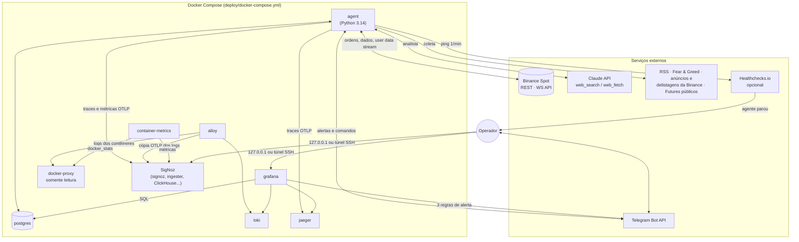
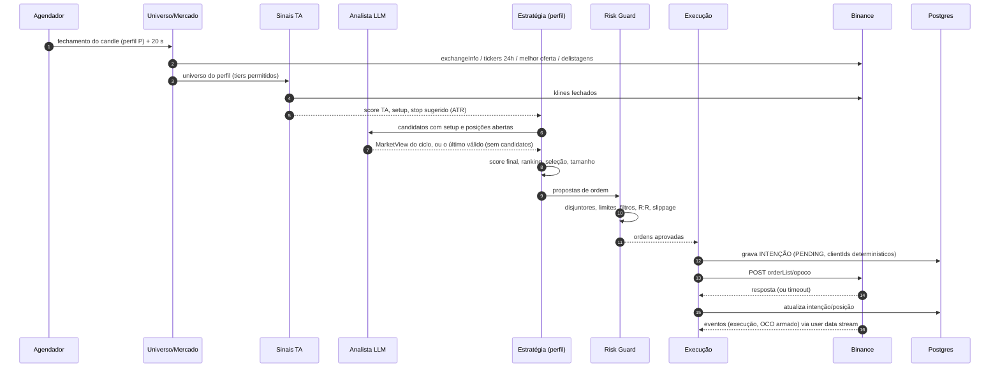
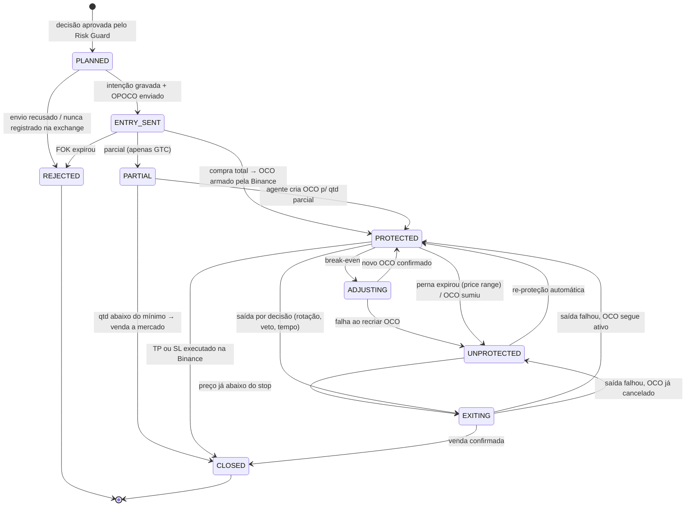
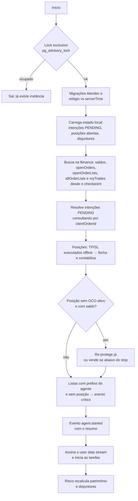

# 03 — Arquitetura: núcleo enxuto com proteção nativa na Binance

> Como o agente é construído e por quê. Os valores em vigor ficam nos arquivos de `config/`, que são a fonte da verdade; os números citados aqui servem de exemplo. Não são recomendação de investimento.

**Por que esta arquitetura:** nenhum framework maduro avaliado (Freqtrade, Hummingbot, OctoBot) usa as *order lists* nativas da Binance para manter a posição protegida com o bot desligado. O Freqtrade só deixa um stop fixo na exchange, sem take-profit, e os executores do Hummingbot monitoram as barreiras dentro do processo. Por isso o núcleo é próprio e pequeno: toda posição nasce como OPOCO, com o trailing take-profit e o stop no servidor da Binance (doc 01, §2). Com o que é crítico guardado na exchange, a recuperação de uma queda é reconciliar e seguir. O Freqtrade continua como laboratório offline de backtest dos mesmos sinais.

## 1. Princípios de design

1. **A Binance guarda a proteção.** Toda posição nasce protegida por uma *order list* nativa (OPOCO). O agente pode cair a qualquer momento sem deixar posição exposta.
2. **O LLM analisa; o código decide e executa.** O LLM produz dados estruturados (scores, vetos, riscos). Ele **pode vetar ou reduzir risco, nunca ampliar**. O LLM não tem acesso à API de ordens nem às chaves.
3. **Caminho crítico determinístico.** Risk Guard, dimensionamento de posição e montagem de ordens são código puro e testável.
4. **A exchange é a fonte da verdade.** O banco local guarda **intenções** (o que se tentou fazer), o **diário** (o que aconteceu) e o **contexto** (por que foi feito). A reconciliação resolve divergências.
5. **Idempotência em tudo.** Os IDs de ordem derivam da decisão, gravada antes do envio. Um resultado incerto leva a uma consulta pelo ID, nunca a um reenvio às cegas.
6. **Configuração como código.** Perfis, condições de parada e o analista ficam em YAML versionado e validado por schema. O `/config` do Telegram mostra o *hash* da configuração em uso.
7. **Menos peças no caminho crítico.** O núcleo é um processo Python e o PostgreSQL. A observabilidade (Grafana, Loki, Jaeger, SigNoz) roda em contêineres à parte: com qualquer um deles fora do ar, o agente segue operando.

## 2. Visão de contêineres



## 3. Stack tecnológica

| Preocupação | Componente | Por quê |
|-------------|------------|---------|
| Linguagem | **Python 3.14** (compatível com ≥ 3.12), `uv`, `ruff`, `mypy`, `pytest` | Ecossistema quant e SDKs oficiais (D-002) |
| Núcleo | **`asyncio`**, com tarefas periódicas, *jobs* de fechamento de candle e serviços supervisionados em `runtime.py` | WebSocket, Telegram, HTTP e agendamento num único processo, sem biblioteca de agendamento (D-003) |
| API Binance | **Cliente próprio fino** sobre `httpx` (REST) e `websockets` (WebSocket API), com assinatura Ed25519/HMAC via `cryptography` | `Decimal` de ponta a ponta (sem `float`), erros mapeados por semântica (rejeitado × status desconhecido), cabeçalhos de peso, trava de envio de ordens, 100% testável com `respx` (D-001) |
| Indicadores | **TA-Lib** + pandas | Padrão de mercado e maduro (D-015) |
| LLM | **SDK `anthropic`**: `claude-opus-5` na leitura e `claude-sonnet-5` na triagem (`config/research.yaml`) | *Structured outputs*, busca web no servidor e *prompt caching* (D-019) |
| Coleta de notícias | `feedparser` + `httpx` | RSS e APIs simples |
| Configuração | **pydantic-settings** (`.env`, prefixo `TA_`) + YAML validado por pydantic | Validação forte de perfis e limites |
| Persistência | **PostgreSQL 18** + SQLAlchemy 2 (asyncpg) + Alembic | Confiável, com acesso concorrente pelo Grafana e migrações versionadas (D-008) |
| Logs | `structlog` em JSON, com o `trace_id` em cada linha | Logs estruturados e ligados aos traces |
| Traces e métricas | **OpenTelemetry** (OTLP/HTTP) para o Jaeger e o SigNoz | Cada componente é um serviço; métricas do agente a cada minuto (§12.1) |
| Alertas e comandos | **Cliente próprio fino** da Bot API do Telegram, sobre `httpx` | Push no celular e *kill switch* remoto (D-022) |
| Painéis e alertas de métricas | **Grafana 12.2** (Postgres, Loki e Jaeger; *contact point* Telegram) | As métricas de negócio são de baixa frequência e já estão no banco |
| Logs centralizados | **Loki**, com coleta pelo **Grafana Alloy** | Logs de todos os contêineres por 30 dias |
| Traces | **Jaeger** (7 dias em disco) | Grafo de dependências entre os componentes |
| Observabilidade em paralelo | **SigNoz** (ClickHouse) | Traces, logs e métricas num lugar só, para comparar (§12.1) |
| Heartbeat externo | **Healthchecks.io**, opcional (`TA_HEALTHCHECK_URL`) | Detecta o agente ou a máquina fora do ar, algo que o monitoramento interno não consegue |
| Laboratório de backtest (offline) | **Freqtrade** via Docker (backtesting e *hyperopt*) | Reaproveita um backtester maduro. A estratégia "casca" importa o pacote `signals` (D-014) |
| Implantação | **Docker Compose** | Simples e reprodutível |

**Deliberadamente fora:** Redis, broker de mensagens, Prometheus, Kubernetes, LangGraph/CrewAI, banco vetorial. Cada um adicionaria operação sem resolver um problema que o desenho tenha.

## 4. Estrutura do código

```text
src/trade_agent/
  cli.py                  # comando trade-agent: run, consultas, ordens manuais, research
  app.py                  # monta o agente: API, banco, risco, decisão, analista, Telegram
  runtime.py              # lock exclusivo, migrações, recuperação, tarefas e serviços
  tracing.py, metrics.py  # OpenTelemetry: spans por componente e métricas do agente
  log.py                  # structlog em JSON, segredos mascarados
  config/                 # settings do .env (pydantic-settings)
  exchange/               # cliente próprio (REST + WS API): assinatura, filtros, arredondamento,
                          #   peso, relógio, user data stream, ambientes (testnet/demo/prod)
  market/                 # candles e universo com tiers
  signals/                # FUNÇÕES PURAS: features técnicas, score e setups (usadas também no lab)
  research/               # coleta de notícias e métricas, triagem e analista LLM (MarketView)
  strategy/               # perfis (YAML), carteira e dimensionamento, saídas e break-even
  decision/               # ciclo de decisão por perfil e agenda dos fechamentos de candle
  risk/                   # condições de parada, estados, monitor de patrimônio, pré-ordem
  execution/              # IDs, montagem de OPOCO/OCO, gateway idempotente, serviço de posições
  reconcile/              # avaliação de cada posição contra a exchange e reconciliação
  persistence/            # modelos SQLAlchemy, repositórios, migrações Alembic
  notify/                 # Telegram: cliente, alertas, comandos e /status
  telemetry/              # fotos de telemetria no Postgres e heartbeat
lab/
  walk_forward.py         # backtests por janela no Freqtrade (Docker), com hyperopt no treino
  freqtrade/              # docker-compose e estratégia "casca" que importa trade_agent.signals
scripts/                  # spike_opoco.py, grafana_dashboards.py, signoz_dashboards.py
evals/analyst/            # casos rotulados para avaliar o analista (D-021)
config/
  profiles.yaml           # perfis (§8)
  stop_conditions.yaml    # condições de parada e pré-ordem (§10)
  research.yaml           # modelos, orçamento, fontes e regras do analista (§7)
deploy/
  docker-compose.yml      # inclui stack.yml com o .env da raiz
  stack.yml               # serviços (§14)
  grafana/, loki/, alloy/, jaeger/, otelcol/, docker-proxy/, postgres/, signoz/
```

## 5. Jobs e cadência

| Job | Frequência | Função |
|-----|-----------|--------|
| `user_data_stream` | contínuo | Eventos de ordem e saldo via WebSocket API (`userDataStream.subscribe.signature`); reconecta ao receber `serverShutdown`. Cada evento dispara a sincronização da posição afetada (D-011) |
| `check_risk` | 1 min | Patrimônio do agente (capital + PnL realizado + aberto), BTC 1h, paridade do USDT, Fear & Greed, erros de API → condições de parada → `pause`/`halt`/`flatten`. A mesma leitura gera as métricas e, a cada 5 min, a foto de telemetria |
| `heartbeat` | 1 min | Ping externo, só com `TA_HEALTHCHECK_URL` definido |
| `reconcile` | 5 min + a cada reconexão do stream | Compara banco × Binance e corrige |
| `sync_time` | 10 min | Desvio do relógio local para o da Binance (três amostras) |
| `ingest` | 15 min | RSS, anúncios da Binance, Fear & Greed, *funding*/OI |
| `universe_refresh` | a cada `decision_cycle` (cache de 5 min, compartilhado pelos perfis do mesmo fechamento) | Filtros de universo e *tiers* (D-027) |
| `research_cycle` | dentro do `decision_cycle`, só com setups ou posições | Analista LLM → `MarketView` (sem candidatos, vale a última leitura válida) |
| `decision_cycle` | fechamento do candle do perfil + 20 s (ex.: 4h) | Sinais → analista → saídas por regra e *break-even* → entradas (validação pré-ordem) → OPOCO. Com `TA_TRADING_ENABLED=false`, roda em **simulação** (D-023) |
| `telegram` | contínuo (*long polling*) | Comandos do operador (§12.3, D-022) |

As tarefas periódicas rodam já na partida, depois da reconciliação inicial. Ainda não há relatório diário automático nem backup agendado: o backup é manual (runbook, §4).

Se o processo reiniciar no meio de um `decision_cycle`, o ciclo pode ser refeito com segurança: as intenções já gravadas e os IDs determinísticos impedem ordens duplicadas, e um ativo com posição ativa não recebe nova entrada (regra "um ativo por vez" e validação pré-ordem).

Os perfis que fecham candle juntos (hoje os dois, em 4h) rodam o ciclo ao mesmo tempo, mas compram um de cada vez, com as posições relidas na hora da compra (D-029).

## 6. Ciclo de decisão



### 6.1 Universo

O universo é montado a cada ciclo, com o ranking de volume do momento (D-027):

1. `exchangeInfo`: `status = TRADING`, moeda de cotação USDT e as flags `ocoAllowed`, `otoAllowed`, `opoAllowed` e `allowTrailingStop`.
2. Exclusões: stablecoins e ativos atrelados a moeda fiduciária, tokens alavancados e pares em `delist-schedule` (só na produção: a Testnet e o Demo não têm a rota).
3. Liquidez: volume de 24h de pelo menos US$ 5 milhões e spread de até 20 bps.
4. Histórico: pelo menos 30 dias de candles.
5. *Tiers* por volume em USDT na própria Binance (D-013): `core` (BTC e ETH), `large` (posições 1 a 20 do ranking, sem o *core*), `mid` (21 a 60) e `small` (o resto). Cada perfil define quais *tiers* pode usar e com qual peso.

### 6.2 Sinais técnicos (`signals/`, funções puras)

- **Features:** tendência (EMA 50/200, ADX), momento (RSI, histograma MACD, ROC), volatilidade (ATR%, largura de Bollinger), volume (volume relativo, inclinação do OBV), força relativa contra o BTC e o regime do BTC (acima ou abaixo da própria EMA 200).
- **Score** ∈ [-1, 1], soma de componentes auditáveis: tendência (±0,35), momento (±0,20), força do ADX (±0,15), força relativa (±0,20), volume (±0,10) e RSI esticado (−0,15).
- **Setups**, ambos **a favor da tendência** (EMA rápida > lenta e preço acima da lenta) e só com o **regime de mercado em alta** (D-016):
  - `trend_pullback`: ADX ≥ `adx_min`, RSI anterior ≤ `rsi_pullback_max` e subindo, em candle de alta;
  - `breakout`: fechamento acima da máxima dos candles anteriores, com volume relativo ≥ `vol_rel_min`.
- **Saída:** `Signal(score, setup, stop_pct, atr_pct, close)`, lido no último candle fechado. O stop sugerido é `atr_mult × ATR%`, limitado por `max_pct` do perfil.
- O mesmo código roda **no agente** e **no laboratório Freqtrade**: a estratégia "casca" importa `trade_agent.signals`. Os parâmetros saem do *hyperopt* em *walk-forward* (D-017), nunca de tentativa e erro em produção.

### 6.3 Combinação, seleção e dimensionamento

- `score_final = (1 − w_llm) · score_TA + w_llm · (sentimento · confiança)`, com `w_llm` (`llm.weight`) definido por perfil. Sem leitura do LLM com a confiança mínima (`llm.min_confidence`), vale só o score técnico.
- **Veto** do LLM exclui o ativo. Se houver posição aberta nele, dispara uma saída.
- **Regime:** o `exposure_multiplier ∈ [0, 1]` do LLM escala o tamanho das posições. Sem leitura válida, cada perfil segue o seu `llm.on_failure` (§7.3).
- **Seleção:** maiores scores acima de `min_score`, respeitando as vagas (`max_open_positions`), a reserva de caixa, os limites por *tier* e a regra de uma posição por ativo entre os perfis.
- **Tamanho:** `qtd = (capital_perfil × risco_por_trade) / (entrada − stop)`, limitado por `max_position_pct`, pelo orçamento e pelo limite do *tier*, escalado pelo `exposure_multiplier`, arredondado ao `stepSize` e validado contra `minNotional`.
- **Saídas por decisão:** rotação (score ≤ `exit_score` por `exit_after_cycles` ciclos), veto e tempo máximo de permanência (`max_holding`). Depois de `break_even_after_r` R de lucro, o agente sobe o stop para a entrada mais as taxas.

## 7. Analista LLM (`research/`)

### 7.1 Fluxo

1. **Ingestão** (`ingest`, a cada 15 min): coleta RSS, anúncios da Binance, Fear & Greed e *funding*/OI; remove duplicatas por *hash*; marca os ativos citados (dicionário símbolo → nomes, em `config/research.yaml`); grava em `news_items`.
2. **Pesquisa**, dentro do ciclo de decisão e só quando há candidatos com setup ou posições abertas (D-023). Sem candidatos, vale a última leitura válida, até `max_view_age_hours` (8 h). Também pode ser disparada à mão (`trade-agent research run`).
3. **Triagem** (`claude-sonnet-5`), no início da pesquisa: as notícias ainda não classificadas recebem relevância, categoria, severidade e ativos. As de relevância abaixo de `min_relevance` saem do digest. Se a triagem falhar, a pesquisa segue com as notícias sem triagem.
4. **Leitura** (`claude-opus-5`), em **duas etapas** (D-019):
   - **(a) verificação web**, opcional (`web.enabled`): `web_search`/`web_fetch`, com até 5 buscas e 3 leituras, para confirmar riscos e catalisadores dos candidatos e das manchetes críticas. Devolve achados em texto, com as URLs;
   - **(b) leitura estruturada**, sem ferramentas: o modelo recebe o **digest** das últimas 12 h, as métricas de mercado, os candidatos e os achados da etapa (a), e produz o `MarketView` com *structured outputs*.
5. **Saída** validada por schema (pydantic) e gravada em `research_reports`, com modelo, versão do *prompt*, fontes, tokens e custo.

### 7.2 Contrato de saída (`MarketView`)

```json
{
  "as_of": "2026-09-25T12:00:00Z",
  "market_regime": "risk_on | neutral | risk_off",
  "global_sentiment": 0.35,
  "exposure_multiplier": 0.8,
  "global_risk_flags": ["FOMC hoje às 15h (volatilidade)"],
  "assets": [
    {
      "asset": "SOL",
      "sentiment": 0.6,
      "confidence": 0.7,
      "horizon": "days",
      "catalysts": ["upgrade de rede anunciado para 30/09"],
      "risk_flags": [],
      "veto": false,
      "rationale": "resumo curto e auditável",
      "sources": ["https://..."]
    }
  ]
}
```

### 7.3 Regras de segurança (aplicadas por código, não por *prompt*)

- Faixas numéricas limitadas: `sentiment ∈ [-1, 1]`, `confidence ∈ [0, 1]`, `exposure_multiplier ∈ [0, 1]`. Valores fora da faixa são truncados.
- **Autoridade assimétrica:** o LLM **não** cria entradas fora do universo, **não** altera stops, TP ou tamanhos além dos limites do perfil, e **não** aumenta a exposição.
- Sentimento positivo acima de 0,5 exige **pelo menos 2 fontes** citadas; sem elas, o valor é rebaixado. Vetos são aceitos sem fonte, porque são conservadores.
- Conteúdo externo entra no *prompt* delimitado e marcado como **dado não confiável**. O LLM não tem ferramentas de escrita nem de execução.
- **Degradação segura:** sem leitura válida (timeout, `stop_reason` inesperado, JSON inválido, orçamento esgotado ou leitura com mais de 8 h), cada perfil segue o seu `llm.on_failure`: `ta_only` (TA pura), `ta_only_reduced` (TA pura com metade da exposição, o usado pelos dois perfis atuais) ou `pause_entries` (sem entradas novas).

### 7.4 Uso da API Claude

- Leitura com **`claude-opus-5`**, *adaptive thinking* e *effort* `high`; triagem com **`claude-sonnet-5`**. Os modelos, os limites de tokens e o *timeout* ficam em `config/research.yaml`.
- **Structured outputs** (`output_config.format` com JSON Schema gerado pelo SDK) na etapa (b). O schema pedido ao modelo não tem restrições numéricas: as faixas são aplicadas pelo código (§7.3), para que um valor fora da faixa seja truncado em vez de invalidar a resposta inteira.
- Ferramentas de servidor `web_search_20260209` / `web_fetch_20260209` com `max_uses`.
- **Prompt caching** do *system prompt*, das instruções e do schema, que formam o prefixo estável.
- **Teto de custo diário** de US$ 5 (`budget.daily_usd`, dia UTC). Ao atingi-lo, o analista não é chamado e cada perfil degrada conforme `llm.on_failure`. Tokens, cache, buscas e custo por chamada ficam em `llm_usage`, inclusive quando a resposta é inválida.
- **Custo observado no Demo** (29/09 a 03/10/2026): de US$ 0,52 a US$ 4,25 por dia, conforme o número de ciclos com candidatos, sempre abaixo do teto. A etapa (a), de verificação web, responde por cerca de 83% do custo; a leitura estruturada e a triagem custam pouco (a avaliação, só com a etapa (b), saiu por US$ 0,02 por caso). Preços em [05-referencias.md](05-referencias.md).

### 7.5 Avaliação do LLM

- **Casos rotulados** (`evals/analyst/cases.yaml`, D-021): 31 situações, 19 históricas e 12 sintéticas (incluindo injeção de *prompt*), só com a etapa (b). A última execução (`trade-agent research eval`, 28/09/2026) aprovou os 31 casos, com 100% das saídas válidas no schema.
- **Ainda não implementado:** o A/B no Demo (um clone de cada perfil com `llm.weight = 0`) e a correlação entre o `sentiment` e o retorno dos dias seguintes. Sem eles, não há medida do quanto o LLM melhora o resultado (doc 04).

## 8. Perfis de alocação (R2)

Os perfis ficam em `config/profiles.yaml`, validados por schema (`strategy/profiles.py`). O laboratório lê o mesmo arquivo (D-014). Perfis em uso, calibrados em 01/10/2026 pelo *walk-forward* otimizado (D-028, [lab-resultados.md](lab-resultados.md)):

| | `swing_trend` (`swg`) | `momentum_alpha` (`mom`) |
|---|---|---|
| Capital | 65% do `managed_capital` (650 USDT) | 35% (350 USDT) |
| Timeframe | 4h | 4h |
| *Tiers* | core 70%, large 30% | core 30%, large 50%, mid 20% |
| Posições, tamanho, reserva | até 2; até 42% do capital; reserva de 15% | até 2; até 42%; reserva de 15% |
| Risco por trade | 1,2% | 1,5% |
| Entrada | `min_score` 0,67, `limit_fok`, *slippage* até 18 bps | `min_score` 0,67, `limit_fok`, até 20 bps |
| Stop | fixo, 3,1 × ATR, no máximo 4,5% | fixo, 3,0 × ATR, no máximo 5% |
| Take-profit | trailing, ativação em +9,7%, recuo de 100 bps | trailing, ativação em +9,5%, recuo de 130 bps |
| *Break-even* e prazo | depois de 1,2 R; 18 dias | depois de 1,0 R; 6 dias |
| Saída por score | `exit_score` −0,46, já no primeiro ciclo | −0,46, no primeiro ciclo |
| Sinais | ADX ≥ 24, RSI do recuo ≤ 41, volume relativo ≥ 2,3 | ADX ≥ 29, RSI ≤ 35, volume ≥ 2,6 |
| LLM | peso 0,25, confiança mínima 0,65, `ta_only_reduced` | peso 0,30, confiança 0,60, `ta_only_reduced` |

O laboratório não otimiza o risco, o *break-even* nem o prazo máximo (D-017); esses valores são do usuário.

Estrutura de um perfil (os valores de `swing_trend`):

```yaml
account:
  quote_asset: USDT
  managed_capital: 1000         # teto de capital do agente (o resto da conta é ignorado)
  one_position_per_asset: true  # dois perfis nunca no mesmo ativo

profiles:
  swing_trend:
    code: swg                   # vai nos IDs de ordem (ta1-swg-...)
    enabled: true
    capital_share: 0.65         # fração do managed_capital
    timeframe: 4h               # 15m | 1h | 4h | 1d
    tiers: {core: 0.70, large: 0.30, mid: 0.0, small: 0.0}   # alocação máxima por tier
    allocation:
      max_open_positions: 2
      max_position_pct: 0.42
      cash_reserve_pct: 0.15
      risk_per_trade_pct: 1.2   # % do capital do perfil perdido se o stop executar
    entry:
      min_score: 0.67
      order: limit_fok          # limit_fok | limit_maker_gtc
      max_slippage_bps: 18
    protection:                 # vira o OCO do OPOCO
      stop: {mode: fixed, atr_mult: 3.1, max_pct: 4.5}   # fixed | trailing
      take_profit: {mode: trailing, activation_pct: 9.7, trailing_delta_bps: 100}
      break_even_after_r: 1.2   # ajuste feito pelo agente
      max_holding: 18d
    exits: {exit_score: -0.46, exit_after_cycles: 1}
    signals: {adx_min: 24.0, rsi_pullback_max: 41.0, vol_rel_min: 2.3}
    llm: {weight: 0.25, min_confidence: 0.65, on_failure: ta_only_reduced}
```

**Vários perfis numa mesma conta:** cada perfil opera a sua cota do `managed_capital`. As posições são marcadas pelo código do perfil no prefixo dos IDs de ordem (`ta1-swg-...`, `ta1-mom-...`), e a reconciliação é feita **por posição e por ordem**, não pelo saldo agregado. Saldos sem a marca do agente são **ignorados**. Mesmo assim, recomenda-se uma conta dedicada.

## 9. Execução e ciclo de vida da posição (R4)

### 9.1 Modelo de ordem padrão: OPOCO

Exemplo de requisição com a proteção do `swing_trend` (preços ilustrativos):

```text
POST /api/v3/orderList/opoco
symbol=SOLUSDT
listClientOrderId=ta1-swg-7f3a9c2b1d-0-L   # determinístico: app, perfil, decisão, seq e perna (§11.2)
workingType=LIMIT
workingSide=BUY
workingPrice=142.35                        # "marketable limit": melhor ask + tolerância de slippage
workingQuantity=0.70
workingTimeInForce=FOK                     # tudo ou nada: sem execução parcial desprotegida
workingClientOrderId=ta1-swg-7f3a9c2b1d-0-E
pendingSide=SELL                           # quantidade = recebida na compra (OPO)
pendingAboveType=TAKE_PROFIT
pendingAboveStopPrice=156.16               # ativa o trailing a +9,7%
pendingAboveTrailingDelta=100              # vende após recuo de 1% do topo
pendingAboveClientOrderId=ta1-swg-7f3a9c2b1d-0-TP
pendingBelowType=STOP_LOSS                 # a mercado: saída garantida em queda
pendingBelowStopPrice=135.95               # 3,1 × ATR, no máximo 4,5% abaixo
pendingBelowClientOrderId=ta1-swg-7f3a9c2b1d-0-SL
newOrderRespType=FULL
```

Opções por perfil:

| Parâmetro | Opções | Observação |
|-----------|--------|------------|
| Entrada | `limit_fok` (padrão) · `limit_maker_gtc` | FOK dispensa tratamento de parcial. GTC maker paga taxa menor, mas exige *timeout* e tratamento de parcial (ver 9.3) |
| Perna de cima (`take_profit.mode`) | `trailing`: `TAKE_PROFIT` + `stopPrice` + `trailingDelta` · `limit`: `LIMIT_MAKER` (alvo fixo) | O trailing TP maximiza o ganho com o agente desligado. Os dois perfis usam `trailing` |
| Perna de baixo (`stop.mode`) | `fixed`: `STOP_LOSS` com `stopPrice` · `trailing`: `STOP_LOSS` só com `trailingDelta` (sobe junto com o preço desde a entrada) | Sempre `STOP_LOSS` a mercado: prioriza sair sobre o preço. Os dois perfis usam `fixed` |

> Todas essas combinações passaram no Spot Testnet em 28/09/2026, e o OPOCO opera no Demo Mode desde 29/09 (doc 01, §3).

### 9.2 Máquina de estados da posição



`UNPROTECTED` é sempre um alerta **crítico** e o reconciliador age imediatamente.

### 9.3 Casos especiais

- **Execução parcial (entrada `limit_maker_gtc`):** o OPOCO só arma o OCO depois da execução **total**. Enquanto a entrada está parcial, a posição fica em `PARTIAL`, com um evento alto. Se a entrada terminar com parte executada (cancelada ou expirada), a posição vai para `UNPROTECTED`, e o agente cria um OCO avulso (`orderList/oco`) para a quantidade executada, ou a encerra como resíduo se estiver abaixo do mínimo. Não há *timeout* automático para cancelar uma entrada GTC, e com o agente desligado a parte executada fica sem proteção: por isso os perfis usam **FOK**.
- **Ajuste de proteção** (*break-even*): não há troca atômica de *order list*. O agente grava a intenção `adjust`, cancela a lista e cria o novo OCO em seguida; a janela sem proteção é de milissegundos. Se o novo OCO for **rejeitado**, ele **vende a mercado** (*fail-safe*, D-007). Numa falha de conexão, registra um evento crítico e tenta de novo na sincronização seguinte. Com resultado incerto, a reconciliação consulta o ID antes de qualquer reenvio.
- **Saída por decisão:** cancelar a lista e vender a mercado.
- **Stop expirado por *price range*:** o evento do *user data stream* traz o `expiryReason`. A posição vai para `UNPROTECTED`, e o agente re-protege sobre o preço médio de entrada ou vende a mercado, se o preço já atravessou o stop (D-010).
- ***Timeout* ao enviar ordem:** **nunca** reenviar às cegas. A Binance aceita repetir um `listClientOrderId` quando a lista anterior já terminou, o que causaria **duplicidade**. Primeiro consultar pelo ID de cliente; só reenviar se ele não existir (D-006, D-012).

### 9.4 O que acontece com o agente desligado

| Situação | Resultado |
|----------|-----------|
| Posição aberta e o preço cai até o stop | `STOP_LOSS` executa na Binance; o TP é cancelado automaticamente |
| O preço sobe e passa da ativação | O trailing TP segue o topo e vende no recuo configurado |
| Stop em modo trailing | O stop sobe junto com o preço, também offline |
| Queda extrema fora da faixa de execução | O stop pode expirar e a posição fica sem proteção até o agente voltar. O alerta "Agente sem telemetria" do Grafana (e o heartbeat externo, se configurado) avisa que o agente está fora |
| Notícia muito negativa | Sem reação do LLM (offline). A proteção por preço continua ativa |
| Agente fora por dias | As posições encerram por stop ou TP. Nenhuma entrada nova. O capital volta para stablecoin |

## 10. Risk Guard e condições de parada (R5)

### 10.1 Validações pré-ordem (sempre, sem exceção)

Feitas em `pre_trade_violations`, para cada ideia de entrada: estado operacional que permite entradas · janela de negociação (`trading_window_utc`) · nenhuma posição ativa no ativo · ativo sem veto do analista e fora de delistagem · R:R mínimo (ativação do take-profit ÷ stop) depois da taxa de ida e volta · risco até o stop ≤ `risk_per_trade_pct`, com a tolerância de arredondamento · `trailingDelta` dentro do filtro `TRAILING_DELTA`. Antes disso, a carteira já aplicou as vagas, a reserva de caixa e os limites por *tier* (§6.3), e a montagem da ordem arredonda preço e quantidade aos filtros (`PRICE_FILTER`, `LOT_SIZE`, `NOTIONAL`), com o preço-limite a no máximo `max_slippage_bps` da melhor oferta. Toda entrada sai com proteção: o `ProtectionPolicy` recusa, na construção, uma política sem stop.

### 10.2 Estados operacionais (global e por perfil)

| Estado | Novas entradas | Proteções na Binance | Saídas por regra | Retorno |
|--------|----------------|----------------------|------------------|---------|
| `RUNNING` | ✅ | ✅ | ✅ | — |
| `PAUSED` | ❌ | ✅ | ✅ | Automático após `cooldown`, ou manual |
| `FLATTENING` | ❌ | Cancela e vende | — | Vai para `HALTED` |
| `HALTED` | ❌ | ✅ (mantidas) | ❌ | **Somente manual** (`/resume`) |

O estado é **persistido** e continua valendo após reinício. Um agente reiniciado em `PAUSED` continua pausado.

### 10.3 Gatilhos configuráveis

Valores em vigor no `config/stop_conditions.yaml`:

```yaml
global:
  max_daily_loss_pct:      {value: 3,   action: pause,      cooldown: 24h}
  max_drawdown_pct:        {value: 15,  action: halt}                      # a partir do pico
  max_consecutive_losses:  {value: 4,   action: pause,      cooldown: 12h}
  btc_move_1h_pct:         {value: -6,  action: pause,      cooldown: 4h}
  quote_depeg_pct:         {value: 1.5, action: flatten}                   # USDT fora da paridade
  fear_greed_below:        {value: 10,  action: pause,      cooldown: 24h}
  api_error_rate_5m:       {value: 0.2, action: pause,      cooldown: 30m}
  reconcile_mismatch:      {action: pause}                                 # até diagnóstico
  profit_target_pct:       null                                            # ex.: {value: 30, action: halt}
  trading_window_utc:      null                                            # ex.: ["00:00-23:59"]
```

Em `per_profile`, um perfil pode ter os próprios `max_daily_loss_pct` e `max_consecutive_losses`, que pausam só aquele perfil. Em `pre_trade` ficam os limites da validação pré-ordem: R:R mínimo de 1,5 depois da taxa de ida e volta de 0,2%, e tolerância de 5% sobre o risco por trade.

O teto de gasto com o LLM fica em `config/research.yaml` (`budget.daily_usd`, D-019): ao atingi-lo, o analista não é chamado e cada perfil degrada conforme `llm.on_failure`. Semântica (D-024): as perdas e a meta são medidas sobre o **patrimônio do agente** (capital gerido + PnL realizado + PnL aberto), e não sobre o saldo da conta; gatilhos automáticos só **escalam** o estado; um `flatten` termina em `HALTED` marcado, e o mesmo gatilho não o repete até o `/resume`. Cada gatilho age **uma vez por ocorrência** (D-026): enquanto a condição continua valendo, ele não estende a pausa nem alerta de novo, e o `/resume` e o fim do `cooldown` valem. Ele volta a agir quando a condição passa e volta, ou quando piora mais um limite inteiro (4 → 8 perdas seguidas; perda diária de 3% → 6%).

**Kill switch:** `/halt` (mantém as proteções) e `/flatten` (zera as posições, com código de confirmação) no Telegram. Com `TA_TRADING_ENABLED=false` (o padrão), o cliente bloqueia qualquer envio de ordem desde a partida, e o agente roda em simulação (D-023).

## 11. Persistência, idempotência e recuperação (R7)

### 11.1 Modelo de dados (principais tabelas)

| Tabela | Conteúdo |
|--------|----------|
| `intents` | Intenção antes de qualquer envio: tipo (`open`, `protect`, `adjust`, `close`, `failsafe`), *payload*, IDs de cliente e status (`pending` → `confirmed`, `failed` ou `unknown`, este último resolvido pela reconciliação) |
| `positions` | Perfil, símbolo, estado (máquina do §9.2), entrada, quantidade protegida, parâmetros de proteção, PnL, taxas e motivo da saída |
| `exchange_orders`, `fills` | Espelho das ordens e das execuções da Binance (JSON bruto incluso) |
| `events` | Trilha de auditoria com severidade: ciclos de decisão, mudanças de estado de risco, comandos do Telegram, falhas de tarefas, eventos das posições |
| `checkpoints` | Estado chave-valor: estados de risco por escopo (`risk.state.*`), gatilhos já disparados (`risk.fired`), abertura do dia e pico do patrimônio (`risk.equity`), *offset* do Telegram |
| `telemetry_snapshots` | Foto de patrimônio, PnL, exposição e saúde da API a cada 5 min |
| `news_items`, `research_reports`, `llm_usage` | Notícias coletadas e triadas, leituras do analista, tokens e custo de cada chamada |

As decisões de cada ciclo ficam nos eventos `decision.cycle` (avaliados, entradas, saídas e recusas) e, no detalhe, nos logs e traces (§12.1).

### 11.2 Idempotência

- `clientOrderId` e `listClientOrderId` determinísticos, com até 36 caracteres: `ta1-{perfil}-{decisão}-{seq}-{perna}` (ex.: `ta1-mom-7f3a9c2b1d-0-TP`). `seq` numera as proteções sucessivas da mesma posição (0 = OPOCO original; 1.. = OCOs recriados em ajustes) e `perna` ∈ {`L`, `E`, `TP`, `SL`, `X`}. Implementação: `trade_agent.execution.ids`.
- Padrão **intenção → envio → confirmação**. Com resultado incerto, o próximo passo é sempre **consultar** a ordem pelo ID de cliente antes de qualquer reenvio.
- Cada decisão de entrada tem um ID único (10 hex), gravado com a posição antes do envio. Os espelhos de ordens e execuções têm chaves únicas (símbolo + ID da ordem ou do trade), então eventos repetidos do *user data stream* não duplicam nada.

### 11.3 Recuperação na partida



- Ordens **sem** o prefixo do agente nunca são tocadas. Listas **com** o prefixo e sem posição correspondente geram um evento crítico, sem ação automática (D-009), e contam para o disjuntor `reconcile_mismatch`, que pausa as entradas até o diagnóstico.
- A reconciliação periódica (a cada 5 min e a cada reconexão do stream) roda os passos E–J. Órfãs e erros que ela não resolve disparam o `reconcile_mismatch`.
- **Resiliência de processo:** `restart: unless-stopped` no Docker; relógio sincronizado com a Binance a cada 10 min; reconexão do WebSocket com *backoff* exponencial, com a reconciliação periódica cobrindo eventos perdidos; os erros 418 e 429 trazem o `Retry-After` informado pela Binance e contam na taxa de falhas que pausa as entradas (`api_error_rate_5m`).

## 12. Monitoramento (R6)

### 12.1 Dashboards, logs, traces e métricas

Seis dashboards no Grafana, gerados por `scripts/grafana_dashboards.py`:

1. **Visão geral:** patrimônio e pico, PnL do dia, drawdown, posições ativas, estado operacional, mudanças de estado do risco e última execução de cada tarefa.
2. **Posições:** posições ativas com a proteção, PnL não realizado, exposição e posições encerradas no período.
3. **Performance:** PnL realizado acumulado, trades, taxa de acerto, *profit factor*, taxas pagas, resultado por perfil e ativo e motivos de saída.
4. **Decisões e pesquisa:** ciclos de decisão, última leitura do analista, regime e exposição, custo diário do LLM, ciclos do analista por status e notícias por fonte.
5. **Saúde técnica:** idade da última foto de telemetria, intenções pendentes, posições sem proteção, eventos críticos, erros e peso da API, *offset* do relógio e eventos altos e críticos.
6. **Logs:** erros, avisos e tracebacks, volume por nível e por serviço, eventos mais frequentes do agente e busca por texto.

Os logs de todos os contêineres ficam centralizados no **Loki** por 30 dias. A coleta é do **Grafana Alloy**, que lê a API do Docker por um proxy somente leitura numa rede interna exclusiva. Os rótulos são `service` e `level`, e o `event` do structlog vai como metadado estruturado.

Os **traces** usam OpenTelemetry com exportação OTLP/HTTP ao **Jaeger** (7 dias em disco). Cada componente do agente é um serviço no namespace `trade-agent`: runtime, risco, decisão, pesquisa, LLM, execução, exchange, reconciliação, banco, Telegram e telemetria. Assim, o grafo *System Architecture* do Jaeger mostra as dependências entre eles. O Jaeger não publica portas no host: os traces aparecem no Grafana (*Explore* → *Traces*), e a interface do Jaeger só abre em desenvolvimento, pelo repasse `jaeger-ui` (`DEV_JAEGER_UI=1`, desligado por padrão). Cada tarefa de fundo é a raiz de um trace. Os spans nunca levam segredos nem conteúdo: só caminhos, métodos, contagens, identificadores, tokens e custos. O `trace_id` vai em cada log, e o Grafana liga logs e traces nos dois sentidos.

O **SigNoz** roda em paralelo, para comparação. Ele recebe os mesmos traces, uma cópia OTLP dos logs e as **métricas** OpenTelemetry. As métricas do agente saem a cada minuto: patrimônio, drawdown, PnL, exposição, posições, erros e peso da Binance, relógio, estado do risco, custo e tokens do LLM, ciclos, entradas e saídas. As de cada contêiner (CPU, memória, rede e disco) vêm de um OpenTelemetry Collector com `docker_stats`. Latência, vazão e erros por operação o SigNoz calcula a partir dos spans. Quatro dashboards (operação, saúde técnica, LLM e contêineres) são gerados por `scripts/signoz_dashboards.py` (runbook, §1.3).

### 12.2 Alertas

| Origem | O que alerta | Canal |
|--------|--------------|-------|
| **Agente** | 🚨 cada mudança de estado do risco para `paused`, `halted` ou `flattening`, uma vez por ocorrência do gatilho (D-026); ℹ️ a volta a `running`; ℹ️ entradas e saídas de cada ciclo de decisão | Telegram |
| **Grafana**, independente do agente | **Agente sem telemetria** (nenhuma foto há mais de 15 min, ou consulta sem dados); **Posição sem proteção** (`unprotected` há mais de 1 min); **Drawdown elevado** (acima de 10% por 5 min) | Telegram |
| **Healthchecks.io**, opcional | Agente ou máquina sem heartbeat | E-mail ou o canal configurado no Healthchecks |

Os demais eventos altos e críticos (falha ao re-proteger, órfã, resultado de ordem desconhecido, tarefa com falha) ficam em `events` e aparecem no painel *Saúde técnica* → "Eventos altos e críticos", sem mensagem no Telegram. Sem Telegram configurado, os alertas do agente vão só para o log.

### 12.3 Comandos do Telegram

`/status` · `/positions` · `/pnl [dia|semana|mes]` · `/pause [escopo]` · `/resume [escopo]` · `/halt [escopo]` · `/flatten [escopo]` (exige código de confirmação) · `/report` (último `MarketView`) · `/config` (perfis ativos e *hash* da configuração). O escopo é `global` (padrão) ou o nome de um perfil.
Apenas um `chat_id` autorizado. Todo comando é auditado em `events`.

## 13. Segurança

- **Chave Binance:** Ed25519; somente *Reading* + *Spot Trading*; **saques desabilitados**; lista de IPs restrita; chaves diferentes para testnet, demo e produção. Na conta: 2FA, código antiphishing e lista branca de endereços de saque.
- **Segredos:** fora do repositório, no `.env` e em `secrets/` (chave privada Ed25519), ambos ignorados pelo git. As configurações sensíveis são `SecretStr`, e os logs mascaram chaves, assinaturas, senhas e tokens (`***`).
- **LLM isolado:** não recebe segredos nem saldos detalhados além do necessário e não tem ferramentas de execução. A saída passa por schema e limites.
- **Rede:** todas as portas publicadas escutam só em `127.0.0.1` (um teste garante). Numa VPS, o acesso é por túnel SSH ou Tailscale, com SSH só por chave, firewall e atualizações automáticas de segurança.
- **API do Docker:** só os coletores (Alloy e `container-metrics`) a alcançam, por um proxy somente leitura numa rede interna, porque a inspeção de um contêiner mostra as variáveis de ambiente. Nenhum serviço monta o `docker.sock` além do proxy.
- **Grafana:** lê o banco com um usuário somente leitura (`grafana_ro`).
- **Backups:** ainda manuais (`pg_dump`, runbook §4). Um backup diário criptografado fora da máquina, com teste de restauração, faz parte do *go-live* (doc 04).
- **Trilha de auditoria:** ciclos de decisão, comandos do Telegram e mudanças de estado ficam em `events`.

## 14. Implantação

`docker compose -f deploy/docker-compose.yml up -d` sobe tudo. O arquivo inclui `deploy/stack.yml` com as variáveis do `.env` da raiz, que é obrigatório (runbook, §4).

| Serviço | Imagem | Papel | Porta (só `127.0.0.1`) |
|---------|--------|-------|------------------------|
| `agent` | construída do repositório | o agente (`trade-agent run`); lê o `.env` e monta `config/` somente leitura | — |
| `postgres` | `postgres:18` | banco do agente; cria o usuário `grafana_ro` na primeira inicialização | 5432 |
| `grafana` | `grafana/grafana:12.2.0` | dashboards, datasources e alertas provisionados como código | 3000 |
| `loki` | `grafana/loki:3.7.8` | logs por 30 dias | — |
| `alloy` | `grafana/alloy:v1.20.1` | coleta os logs dos contêineres para o Loki e o SigNoz | 12345 |
| `docker-proxy` | `tecnativa/docker-socket-proxy:v0.5.0` | API do Docker somente leitura, para o Alloy e o `container-metrics` | — |
| `jaeger` | `jaegertracing/jaeger:2.20.0` | traces por 7 dias (fixado: a 2.21 removeu a API que o Grafana usa) | — |
| `jaeger-ui` | `alpine/socat:1.8.1.3` | só desenvolvimento (Windows): repassa a interface do Jaeger; desligado por padrão, `DEV_JAEGER_UI=1` liga | 16686 |
| `container-metrics` | `otel/opentelemetry-collector-contrib` | CPU, memória, rede e disco de cada contêiner, para o SigNoz | — |
| SigNoz (`signoz-*`, `ingester`) | manifestos do Foundry em `deploy/signoz/` | traces, logs e métricas em paralelo | 8080, 14318 (OTLP) |

- **Ambientes:** `testnet` (validação de ordens), `demo` (*paper trading*, onde o agente roda hoje) e `prod`. É a mesma imagem; muda só `TA_BINANCE_ENV` e as chaves.
- **Onde roda hoje:** numa máquina Windows com Rancher Desktop, com as particularidades de rede do runbook (§1.2). Para produção, a recomendação é uma VPS com 2 vCPU, pelo menos 8 GB de RAM (o SigNoz sozinho pede 4 GB), IP fixo e **região permitida pela Binance** (ex.: Tóquio, Frankfurt, São Paulo). A latência não é crítica para swing trading.
- **Deploy:** `git pull` + `docker compose -f deploy/docker-compose.yml up -d --build`. As migrações Alembic rodam na partida, e o *lock* exclusivo impede duas instâncias durante o *deploy*.

## 15. Registro de decisões de implementação

| ID | Data | Decisão | Motivo | Alternativa descartada |
|----|------|---------|--------|------------------------|
| D-001 | 26/09/2026 | **Cliente próprio e fino para a API da Binance** (`httpx` + `websockets` + `cryptography`), em vez do SDK oficial `binance-sdk-spot` | O SDK oficial tipa preço e quantidade como `float` e os serializa com `str(float)`: `0.00001` vira `1e-05`, que a Binance rejeita (`-1100`). O SDK também traz muitas dependências (aiohttp, requests, websockets, websocket-client, pycryptodome) e código gerado difícil de simular em testes. A superfície necessária é pequena: cerca de 15 endpoints REST e a assinatura do *user data stream* | `binance-sdk-spot` (suporta OPOCO, mas com os problemas acima); CCXT (order lists só pela API implícita) |
| D-002 | 26/09/2026 | Python 3.14 no desenvolvimento e na imagem Docker (projeto compatível com ≥ 3.12); `uv` com lockfile | Todas as dependências têm *wheels* para 3.14; `uv.lock` garante builds reprodutíveis | pip + venv sem lockfile |
| D-003 | 26/09/2026 | Núcleo **assíncrono** (`asyncio`) | O agente combina WebSocket (*user data stream*), agendador, Telegram e HTTP concorrentes num único processo | Threads |
| D-004 | 26/09/2026 | Cobertura de testes **100% (linhas e ramos)** exigida no CI para `src/`; testes `live` (Testnet/Demo) separados por marcador | Requisito de cobertura total. O que depende da exchange real é validado à parte, sem tornar a suíte padrão dependente de rede | Cobertura parcial |
| D-005 | 26/09/2026 | **Binance simulada em memória** (`tests/support/fake_binance.py`) para os testes de integração: assinatura HMAC, OPOCO/OCO, gatilhos com trailing, saldos bloqueados e injeção de falhas | Testar ponta a ponta os fluxos críticos (proteção, idempotência, recuperação) de forma determinística e sem rede | Apenas mocks por endpoint (não exercitam o encadeamento de estados) |
| D-006 | 26/09/2026 | Retentativa automática **somente** em falha de conexão comprovada (requisição não enviada). Status desconhecido (timeout de leitura, 5xx, `-1006`/`-1007`) leva a **consulta** pelo ID de cliente; se não for encontrado, `OrderOutcomeUnknownError` fica para a reconciliação | A Binance aceita repetir um `listClientOrderId` depois que a lista anterior terminou, então reenviar às cegas pode duplicar posições | Reenvio com o mesmo ID |
| D-007 | 26/09/2026 | Troca de proteção = cancelar a lista + criar o novo OCO; se o novo OCO for **rejeitado**, **venda a mercado** (*fail-safe*); se a lista antiga já tinha terminado, nada é enviado | Não existe substituição atômica de *order list* na API; a posição nunca pode ficar sem proteção | Manter a posição sem proteção até a próxima reconciliação |
| D-008 | 26/09/2026 | Driver **asyncpg** para o PostgreSQL | O `psycopg` assíncrono não funciona com o *event loop* padrão do Windows (Proactor). O asyncpg funciona em Windows e Linux e é maduro | psycopg 3 com `SelectorEventLoop` forçado |
| D-009 | 26/09/2026 | Listas do agente sem posição correspondente (**órfãs**) geram **alerta crítico, sem ação automática** | Sem o contexto da decisão original (política, perfil), qualquer ação automática seria um palpite. A própria lista já protege o saldo na exchange | Adotar a lista criando uma posição sintética |
| D-010 | 26/09/2026 | **Re-proteção** resolve a política sobre o **preço médio real de entrada**. Ativação e alvo do TP sobem para pelo menos +10 bips do preço atual, e o stop original é mantido. Se o preço já atravessou o stop, a posição é **vendida a mercado** | Preserva o plano de risco original sem gerar ordens rejeitadas por "disparo imediato" | Recalcular a proteção a partir do preço atual (mudaria o risco) |
| D-011 | 26/09/2026 | O estado das posições é **sempre derivado da exchange**: eventos do User Data Stream apenas disparam a sincronização (REST) da posição afetada; reconexões do stream disparam a reconciliação completa | Uma única lógica de derivação (`assess`), robusta a eventos perdidos, duplicados ou fora de ordem | Aplicar os eventos incrementalmente ao estado local |
| D-012 | 26/09/2026 | **Carência de 60 s** antes de concluir que uma intenção sem registro na exchange nunca foi aceita; IDs de ordem **nunca são reutilizados** (`seq` sempre avança) | As consultas da Binance (fonte "Database") podem ficar alguns instantes atrás do motor de negociação | Decidir imediatamente com base em uma única consulta |
| D-013 | 26/09/2026 | Moeda de cotação **USDT**; timeframe **por perfil** (hoje os dois perfis usam 4h, D-028); **tiers por volume** em USDT da própria Binance (BTC/ETH = *core*; ranking por volume de 24h define *large*/*mid*/*small*) | Decisão do usuário: maior liquidez e nenhuma dependência externa (CoinGecko fica como evolução opcional) | Market cap via CoinGecko |
| D-014 | 26/09/2026 | Laboratório de backtest = **Freqtrade oficial via Docker**. A estratégia "casca" importa o mesmo `trade_agent.signals` de produção e replica a proteção nativa (stop por ATR limitado, trailing TP com ativação, tamanho por risco). `lab/walk_forward.py` gera a configuração a partir de `config/profiles.yaml` (fonte única) | Backtester maduro sem misturar as dependências fixadas do Freqtrade ao agente | Freqtrade no mesmo venv; backtester próprio |
| D-015 | 26/09/2026 | Análise técnica em `float64` (TA-Lib/pandas); preços e quantidades de ordem sempre em `Decimal` | A TA-Lib exige `float64`. A fronteira fica na montagem da ordem (`round_price`/`round_qty`) | Decimal na análise (lento, sem suporte da TA-Lib) |
| D-016 | 26/09/2026 | Setups de entrada só **a favor da tendência** (EMA rápida > lenta, também no rompimento) e com **filtro de regime**: benchmark (BTC) acima da própria EMA lenta; desligável por perfil (`signals.use_regime_filter`) | O primeiro *walk-forward* mostrou compras de *altcoins* com o BTC em queda e rompimentos contra a tendência. São filtros clássicos, definidos antes da otimização | Filtro de regime apenas via LLM (Fase 4) |
| D-017 | 26/09/2026 | Método do laboratório: **walk-forward com otimização**. *Hyperopt* (`SharpeHyperOptLossDaily`, semente fixa; 150 épocas desde 01/10) nos **12 meses anteriores** a cada janela trimestral de validação; os parâmetros escolhidos são aplicados sem ajuste na janela seguinte. Os parâmetros de **risco** do perfil (stop máximo, risco por trade, tamanho máximo) **nunca são otimizados**. Comparação com o *buy & hold* da cesta e do BTC | Avalia fora da amostra e evita escolher parâmetros olhando o período de teste | Backtest com parâmetros fixos (usado só como baseline); otimizar o período inteiro |
| D-018 | 26/09/2026 | **Substituída pela D-028.** Resultado da Fase 3: **conservador (4h) calibrado** com as medianas dos treinos do *walk-forward* (sem *break-even*, saída por score no 1º ciclo, como no laboratório) e **moderado (1h) desabilitado**. Com stop fixo, `protection.stop` (`atr_mult`, `max_pct`) é a **fonte única** do stop por ATR no agente e no laboratório | Decisão do usuário a partir de [lab-resultados.md](lab-resultados.md): expectativa positiva fora da amostra só no conservador | Manter os parâmetros ilustrativos; iterar mais na Fase 3 |
| D-019 | 26/09/2026 | Analista em **duas etapas**: (a) verificação web opcional em texto livre com fontes; (b) leitura **estruturada sem ferramentas** (JSON Schema). Triagem das manchetes com `claude-sonnet-5`; leitura com `claude-opus-5` (*effort* `high`); teto de **US$ 5/dia** | Decisão do usuário (modelos e orçamento). A documentação não garante *structured outputs* junto com ferramentas de servidor; separar as etapas também isola o conteúdo web não confiável da etapa que decide | Uma única chamada com busca e schema |
| D-020 | 26/09/2026 | Fontes do MVP (todas públicas, sem chave): anúncios do site da Binance, RSS (CoinDesk, Cointelegraph, The Block, Decrypt), Fear & Greed (alternative.me) e *funding*/*open interest* da Binance Futures. Configuradas em `config/research.yaml` | Decisão do usuário; cada fonte falha de forma isolada | CryptoPanic e outras fontes pagas |
| D-021 | 26/09/2026 | Avaliação do analista com **31 casos rotulados** (19 históricos com manchetes parafraseadas e 12 sintéticos com ativos fictícios, incluindo injeção de prompt), rodando só a etapa (b), **sem busca web** | Evita viés retrospectivo da busca. Os casos sintéticos reduzem o efeito de o modelo já conhecer os eventos históricos | Avaliar com busca web; só casos históricos |
| D-022 | 26/09/2026 | Telegram por **cliente próprio fino** (Bot API com `sendMessage` e `getUpdates` em *long polling*, via httpx). Um único `chat_id` autorizado; outros chats são ignorados e registrados; `/flatten` exige código de confirmação (2 min); o *offset* é persistido antes de executar o comando (no máximo uma execução) | Decisão do usuário: poucas linhas, sem framework, testável com respx (análogo à D-001) | python-telegram-bot |
| D-023 | 26/09/2026 | Ciclo de decisão **no fechamento do candle** de cada perfil (+20 s), como no laboratório. Com a trava `TA_TRADING_ENABLED` desligada, o agente roda em **simulação**: decide e registra, sem enviar ordens. O analista só é chamado quando há setups ou posições | Decisão do usuário; a simulação permite observar o agente no Demo/produção sem risco | Intervalo fixo |
| D-024 | 26/09/2026 | Condições de parada com os valores do doc 03 §10.3, medidas sobre o **patrimônio do agente** (capital gerido + PnL realizado + aberto, a preço de venda); abertura do dia e pico persistidos. Paridade do USDT pela mediana de USDC/USDT e FDUSD/USDT. Estados só escalam por gatilho; `flatten` → `HALTED` marcado (não se repete) | Decisão do usuário (valores). Saldos que não pertencem ao agente não distorcem as perdas | Patrimônio da conta inteira |
| D-025 | 26/09/2026 | Observabilidade: `telemetry_snapshots` a cada 5 min (do snapshot de risco de 1 min), heartbeat externo por URL (Healthchecks.io), **Grafana 12.2 provisionado como código**: 5 dashboards gerados por `scripts/grafana_dashboards.py`, *datasource* com usuário **somente leitura** (`grafana_ro`) e 3 regras independentes do agente (sem telemetria, posição sem proteção, drawdown) com contato no Telegram. O `chatid` é renderizado na partida do contêiner, porque o Grafana converte variáveis de ambiente numéricas em número. Ampliada depois com o dashboard de logs (6 no total), Loki e Alloy, traces no Jaeger e o SigNoz em paralelo (§12.1) | Verificado num Grafana real: provisionamento, 34 consultas pela API e avaliação das regras | Prometheus + exporter; alertas só pelo agente |
| D-026 | 02/10/2026 | Cada gatilho de parada age **uma vez por ocorrência**. O disparo fica gravado (`checkpoints`, `risk.fired`) enquanto a condição vale; o gatilho só volta a agir se ela passar e voltar, ou se piorar mais um limite inteiro (4 → 8 perdas seguidas; perda diária de 3% → 6%; drawdown de 15% → 30%). Um gatilho barrado por um estado mais restritivo segue armado e age depois do `/resume` | Decisão do usuário (redisparo). Incidente de 02/10/2026: com 4 perdas seguidas, a condição continuava valendo, a pausa de 12h era estendida e alertada a cada minuto (890 alertas) e cada `/resume` durava até a avaliação seguinte | Redisparar só quando a condição passar; redisparar a cada piora (5ª perda) |
| D-027 | 03/10/2026 | O universo é montado **a cada ciclo de decisão**, com o ranking de volume do momento. O cache cai para 5 min, menor que o menor timeframe (15m), e só faz os perfis que fecham candle juntos compartilharem uma montagem, sob uma trava | Com 6 h de cache e ciclos de 4 h, um ciclo sim, outro não, usava o universo do ciclo anterior. Um ativo que rompe com volume forte sobe no ranking justamente nessas horas, e ficava de fora: em 03/10, ONE e AR (breakout, score 0,85) e RESOLV e SAND não entraram nos ciclos. Custo: uma montagem (`exchangeInfo` + volume 24h) por fechamento | Manter as 6 h; cache de 1 h |
| D-029 | 07/10/2026 | Os perfis que fecham candle juntos fazem a **etapa de compra um de cada vez**, sob uma trava do motor, com as posições ativas **relidas na hora**. O resto do ciclo (sinais, pesquisa, saídas) continua em paralelo | Cada perfil lia as posições no início do ciclo, e a pesquisa leva minutos até a compra: em 04/10, `swing_trend` e `momentum_alpha` compraram STRKUSDT no mesmo minuto (245 USDT num ativo, contra o `one_position_per_asset`), e o analista classificou as mesmas notícias duas vezes | Rodar os perfis em sequência (o segundo esperaria a pesquisa do primeiro) |
| D-028 | 01/10/2026 | Perfis `conservador` e `moderado` substituídos por **`swing_trend` e `momentum_alpha`**, ambos em 4h. Os parâmetros otimizados (score mínimo, filtros de sinal, saída por score, take-profit e stop por ATR) são a **mediana dos 15 treinos** do *walk-forward* otimizado (janelas trimestrais de 2023-01 a 2026-09, com candles desde 2021-10). Risco, *break-even* e prazo máximo não são otimizados e seguem os valores do usuário | Decisão do usuário. Fora da amostra: `swing_trend` +107,27% compostos (7/15 janelas positivas, pior drawdown de janela de 11,20%) e `momentum_alpha` +34,36% (10/15, 13,68%), ambos abaixo do *buy & hold* do BTC (+375%) ([lab-resultados.md](lab-resultados.md)) | Manter `conservador` e `moderado` |
