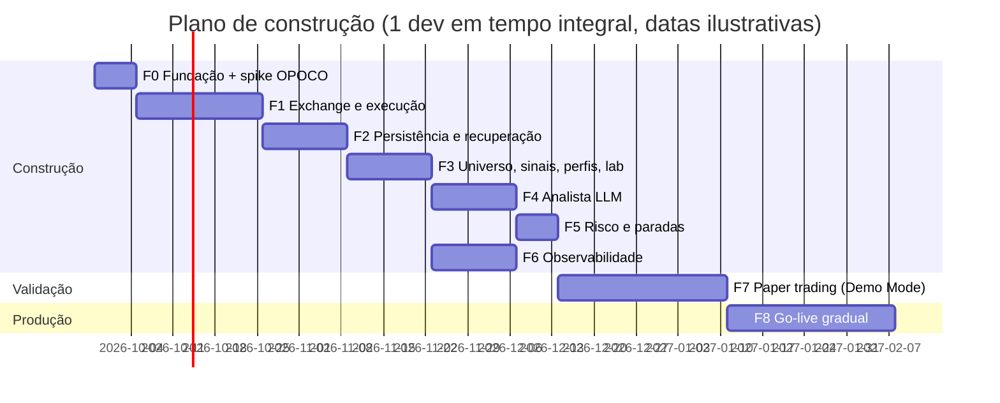

# 04 — Plano de construção

Plano para implementar a **Proposta B** ([03-arquitetura-recomendada.md](03-arquitetura-recomendada.md)).

**Premissas de estimativa:** 1 pessoa desenvolvedora experiente em Python, em tempo integral. Em meio período, multiplique por aproximadamente 2. As datas do cronograma são ilustrativas.

## Andamento

| Fase | Status | Observações |
|------|--------|-------------|
| 0 — Fundação e spike | 🟡 Fundação concluída; **spike aguardando chaves** de Testnet/Demo no `.env` | Tooling (`uv`, ruff, mypy, pytest 100%), cliente REST próprio (D-001), Docker/Compose, `scripts/spike_opoco.py`. Flags OPO/OCO/trailing confirmadas via API pública no Testnet e no Demo |

## 1. Fases

### Fase 0 — Fundação e spike técnico (1 semana)

**Objetivo:** eliminar o maior risco técnico, a validação de OPOCO com trailing, antes de investir no restante.

- Repositório: `uv`, `ruff`, `pytest`, `pre-commit`, Dockerfile, `docker-compose` com Postgres.
- Contas: chaves no **Spot Testnet** e no **Demo Mode** (Ed25519, com lista de IPs quando aplicável).
- **Spike** (script descartável) que envia e observa, nos dois ambientes:
  - OPOCO com `workingTimeInForce=FOK`, perna de cima `TAKE_PROFIT` com `stopPrice` + `trailingDelta`, perna de baixo `STOP_LOSS`;
  - variante com perna de baixo `STOP_LOSS` apenas com `trailingDelta`;
  - cancelamento de lista, OCO avulso e consulta por `listClientOrderId`;
  - assinatura do *user data stream* pela WebSocket API e os eventos recebidos em cada transição.
- Registrar comportamentos e limites observados em `doc/spike-opoco.md`.

**Critério de saída:** todas as combinações aceitas e com o comportamento esperado. Se falhar: ajustar o desenho da proteção ou acionar o **plano B** (Proposta A).

### Fase 1 — Núcleo de exchange e execução (2–3 semanas)

- `exchange/`: cliente próprio (REST + WS API, decisão D-001) por ambiente, cache de `exchangeInfo`, **arredondamento e validação de filtros** (com testes de propriedade via Hypothesis), controle de peso e *backoff*, sincronia de relógio.
- `execution/`: montagem de OPOCO e OCO a partir de um `TradePlan`, saída a mercado e IOC, ajuste de proteção (cancelar e recriar com *fail-safe*).
- *User data stream* com reconexão (`serverShutdown`) e *polling* REST como alternativa.
- CLI de operação manual para testes: `agent order open|close|protect`.

**Critério de saída:** ciclo completo abrir → proteger → ajustar → fechar no Testnet e no Demo, com testes de integração automatizados.

### Fase 2 — Persistência, idempotência e recuperação (1–2 semanas)

- Modelos SQLAlchemy e migrações Alembic (tabelas do doc 03, §11).
- Padrão intenção → envio → confirmação; IDs determinísticos; *lock* exclusivo.
- Reconciliador (na partida e periódico), re-proteção automática, adoção de órfãs.
- **Testes de caos** (ver §2): `kill -9` em pontos críticos, queda de rede, reinício do Postgres.

**Critério de saída:** nenhum cenário de caos resulta em ordem duplicada ou em posição sem proteção por mais de 30 s.

### Fase 3 — Universo, sinais técnicos, perfis e laboratório (2 semanas)

- `market/`: universo, filtros e *tiers* (CoinGecko), delistagens.
- `signals/`: features e scores como **funções puras**, com testes sobre dados conhecidos.
- `strategy/`: combinação, ranking, dimensionamento; `config/profiles.yaml` com validação pydantic.
- `lab/freqtrade/`: estratégia “casca” que importa `signals`; download de dados; backtest e *hyperopt* com **walk-forward** (treino e validação em janelas separadas), incluindo taxas reais.

**Critério de saída:** backtest *walk-forward* dos setups com expectativa positiva após taxas nos períodos de validação e comparado ao BTC *buy & hold*. Sem isso, iterar nesta fase antes de seguir.

### Fase 4 — Analista LLM (2 semanas)

- `research/`: ingestão (RSS, anúncios e delistagens da Binance, Fear & Greed, *funding*/OI), deduplicação e marcação de ativos.
- Chamada à API Claude com *structured outputs*, `web_search`/`web_fetch` limitados, *prompt caching*, teto de custo, registro de uso.
- Regras de segurança do `MarketView` (limites, autoridade assimétrica, exigência de fontes, degradação para TA pura).
- **Conjunto de avaliação** com cerca de 30 situações históricas rotuladas (ex.: hack, delistagem, notícia positiva relevante, ruído) para validar o *prompt* e o schema antes do uso no Demo.

**Critério de saída:** 100% das saídas válidas no schema; vetos corretos nos casos críticos do conjunto de avaliação; custo por ciclo dentro do orçamento.

### Fase 5 — Risco, condições de parada e operação (1 semana)

- `risk/`: validações pré-ordem, disjuntores, estados operacionais persistidos.
- `notify/`: alertas e comandos do Telegram (`/status`, `/pause`, `/halt`, `/flatten`…), com autorização por `chat_id` e confirmação para comandos destrutivos.

**Critério de saída:** cada gatilho de `stop_conditions.yaml` coberto por teste que força a condição e verifica a ação.

### Fase 6 — Observabilidade (1 semana, pode rodar em paralelo às fases 4–5)

- `telemetry/`: snapshots de patrimônio, métricas de saúde e heartbeat (Healthchecks.io).
- Grafana provisionado como código: 5 dashboards e regras de alerta com *contact point* no Telegram.
- *Runbook* de incidentes (ver §4).

**Critério de saída:** um alerta crítico simulado chega ao celular em menos de 1 min; os dashboards mostram o Demo em tempo real.

### Fase 7 — *Paper trading* no Demo Mode (no mínimo 4 semanas de calendário)

- Todos os perfis rodando no **Demo Mode** 24/7 na VPS de produção, com um clone “TA pura” de cada perfil para A/B.
- Revisão semanal: métricas, decisões do LLM, incidentes, ajustes de configuração (versionados).
- Pelo menos um exercício de caos em produção-demo: reiniciar a VPS com posições abertas.

**Critério de saída:** checklist de *go-live* (§3) completo.

### Fase 8 — *Go-live* gradual (contínuo)

- Começar **somente com o perfil conservador** e capital pequeno (o valor que se aceita perder integralmente).
- Aumentar o capital em degraus, e só após N semanas dentro dos limites de risco em cada degrau.
- Os perfis moderado e agressivo entram depois, um por vez.

### Cronograma ilustrativo

Total estimado: **cerca de 11 semanas de construção + no mínimo 4 semanas de *paper trading***.

## 2. Estratégia de testes

| Camada | O que testa | Ferramentas |
|--------|-------------|-------------|
| Unitários | Arredondamento e filtros, dimensionamento, montagem de OPOCO/OCO, máquina de estados, disjuntores, schema do `MarketView` | `pytest`, Hypothesis (propriedades: “nenhuma ordem viola filtro”, “risco ≤ limite”) |
| Integração | Tipos de ordem, erros, *user data stream* | Spot Testnet |
| Backtest | Parte técnica (setups e parâmetros por perfil) | Freqtrade (lab), *walk-forward*, taxas reais |
| Avaliação do LLM | Qualidade e segurança do `MarketView` | Conjunto rotulado + asserções de schema |
| *Forward test* | Sistema completo, A/B TA × TA+LLM | Demo Mode |
| Caos | Recuperação e idempotência | Script que mata o processo entre “intenção gravada” e “resposta”, derruba a rede, reinicia o Postgres, desloca o relógio, simula 429/418, devolve JSON inválido do LLM, provoca *gap* através do stop, execução parcial e duas instâncias simultâneas |

## 3. Checklist de *go-live*

- [ ] 4+ semanas no Demo sem **nenhuma** ordem duplicada e sem posição `UNPROTECTED` por mais de 30 s.
- [ ] Reconciliação sem divergências não explicadas.
- [ ] *Drawdown* máximo e perda diária dentro dos limites de cada perfil.
- [ ] Resultado ajustado ao risco (após taxas) comparado ao BTC *buy & hold* e ao clone “TA pura”. Decisão explícita sobre o peso do LLM.
- [ ] Todos os disjuntores testados; `/halt` e `/flatten` testados no celular.
- [ ] Alertas críticos e heartbeat externo testados, inclusive com a VPS desligada.
- [ ] Chave de produção com saque desabilitado, IP restrito e somente Spot.
- [ ] Backup e restauração testados.
- [ ] *Runbook* revisado.

## 4. Operação — *runbook* resumido

| Incidente | Ação automática | Ação humana |
|-----------|-----------------|-------------|
| Posição sem proteção | Re-proteção imediata ou venda a mercado | Verificar a causa (*price range*, filtro, saldo) |
| Agente fora do ar (sem heartbeat) | — (as proteções seguem na Binance) | Acessar a VPS, ver logs, reiniciar. A partida reconcilia sozinha |
| IP banido (418) / excesso de requisições (429) | *Backoff* e pausa | Revisar o consumo de peso |
| LLM indisponível ou sem orçamento | Degrada para TA pura ou pausa (por perfil) | Revisar custos e *prompts* |
| Disjuntor `HALT` | Mantém proteções e bloqueia entradas | Analisar e `/resume` quando seguro |
| *Depeg* da moeda de cotação | `flatten` (configurável) | Avaliar trocar a moeda de cotação |

Rotina: resumo diário automático; revisão semanal de performance e das decisões do LLM; revisão mensal de parâmetros (sempre via backtest e Demo antes de produção).

## 5. Custos estimados (mensal)

| Item | Estimativa | Observação |
|------|-----------|------------|
| VPS (2 vCPU / 4 GB) | US$ 10–30 | Região permitida pela Binance |
| API Claude | US$ 30–100 | Opus 5: ~US$ 0,35–0,40 por ciclo de pesquisa × 6/dia + gatilhos; com Sonnet 5, cerca de metade. **Teto configurável** |
| Busca web do LLM | Incluída acima | US$ 10 por 1.000 buscas |
| Healthchecks.io, Grafana OSS, Postgres | US$ 0 | Planos gratuitos / open source |
| Taxas de negociação Binance | Variável | Tipicamente 0,1% por lado em conta comum (com desconto pagando em BNB). Consultar `GET /api/v3/account/commission`. **Principal custo de uma estratégia ativa** |
| Fontes de notícias pagas | US$ 0 (opcional) | Começar com fontes gratuitas |

## 6. Riscos do projeto

| Risco | Prob. | Impacto | Mitigação |
|-------|-------|---------|-----------|
| Estratégia sem vantagem real após taxas | Alta | Alto | Critério de saída da Fase 3; A/B no Demo; *go-live* gradual; aceitar “não operar” como resultado válido |
| *Overfitting* no *hyperopt* | Alta | Alto | *Walk-forward*, poucos parâmetros, validação fora da amostra |
| Comportamento de OPOCO ou trailing diferente do esperado | Média | Alto | Spike na Fase 0; plano B (Proposta A) |
| Posição desprotegida (parcial, janela de ajuste, *price range*) | Baixa | Alto | FOK por padrão; *fail-safe* de venda; alerta crítico; reconciliação |
| LLM alucinando ou manipulado por *prompt injection* | Média | Médio | Autoridade assimétrica, schema, exigência de fontes, peso limitado, degradação segura |
| Mudanças na API da Binance | Média | Médio | Cliente próprio com superfície pequena; acompanhar o changelog; testes `live` no Testnet/Demo |
| Custo de LLM acima do previsto | Baixa | Baixo | Teto diário, *prompt caching*, cadência configurável, modelo configurável |
| Restrição regulatória ou de localização | Baixa | Alto | VPS em região permitida; conta verificada; acompanhar os termos da Binance |
| Obrigações fiscais | Certa | Médio | Exportação do diário de operações (`fills`, custos, PnL) para apuração. Consultar um contador |

## 7. Decisões em aberto

1. **Moeda de cotação:** USDT (mais pares e liquidez), USDC ou BRL (18 pares, simplifica a apuração em reais)?
2. **Capital e conta:** conta dedicada ao agente? Nível VIP permite subcontas por perfil?
3. **Perfis ativos no lançamento** e seus parâmetros-alvo (risco por trade, *drawdown* máximo).
4. **Horizonte operacional:** candles de 1h e 4h atendem o objetivo, ou há interesse em horizontes mais longos (rebalanceamento diário ou semanal)?
5. **Modelo de LLM** e orçamento mensal máximo.
6. **Região da VPS** e provedor.
7. **Canal de alertas:** somente Telegram, ou também e-mail/Discord?

## 8. Evoluções futuras (fora do MVP)

- Modelo de *ranking* com ML (ex.: LightGBM) treinado offline, na linha do FreqAI, como mais um score.
- Pesquisa multiagente com debate *bull/bear*, inspirada no TradingAgents, apenas se o A/B mostrar ganho sobre o analista único.
- Modo DCA ou rebalanceamento periódico para o perfil conservador.
- Painel web próprio, somente se o Grafana e o Telegram não bastarem.
